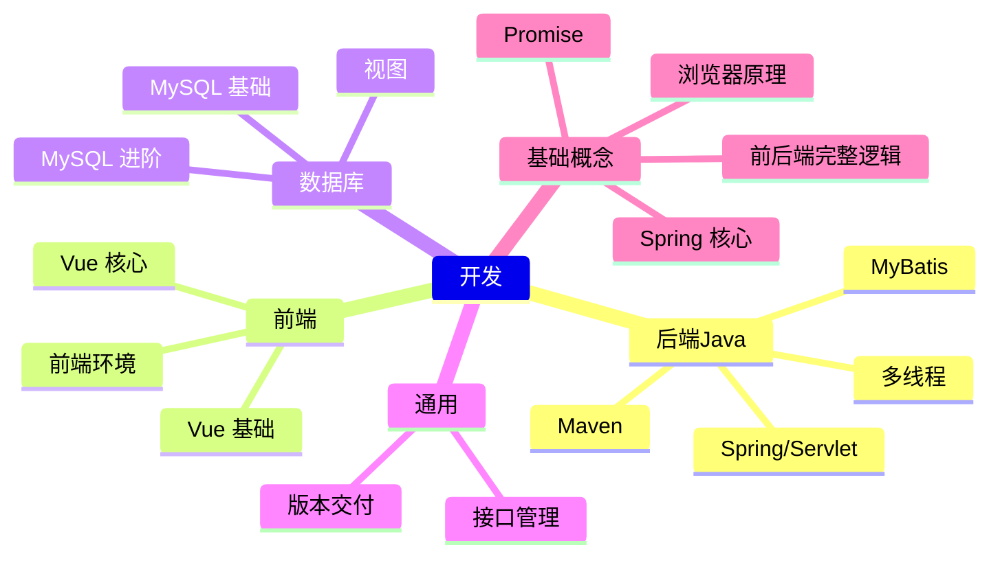

# 🛠 开发领域 MOC

> 软件开发是核心知识领域，覆盖 Java 后端、前端、数据库、测试。

## 知识链一览

## 子领域入口

### 📦 Maven 知识体系
[[01-开发/后端/Java/maven/maven基础概念]] → [[01-开发/后端/Java/maven/maven生命周期1]] → [[01-开发/后端/Java/maven/maven依赖1]] → [[01-开发/后端/Java/maven/maven仓库&包]] → [[01-开发/后端/Java/maven/开发过程maven版本号管理1]]

### ☕ Spring / Servlet
[[01-开发/后端/Java/web/servlet基础]] → [[01-开发/后端/Java/spring/servlet-spring boot 1]] → [[01-开发/后端/Java/spring/servlet-springboot 2]] → [[01-开发/后端/Java/spring/spring 配置优先级]]

### 🖖 Vue 前端
[[01-开发/前端/vue/学习路径]] → [[01-开发/前端/vue/基础概念]] → [[01-开发/前端/vue/vue教程/vue核心]] → [[01-开发/前端/vue/vue结构]] → [[01-开发/前端/vue/响应式数据]]

### 🗄 数据库
[[01-开发/数据库/MySQL/基础]] → [[01-开发/数据库/MySQL/基础1]] → [[01-开发/数据库/MySQL/视图]]

### 🔗 通用
[[01-开发/通用/接口管理/接口]] → [[01-开发/通用/接口管理/接口规范实现]] → [[01-开发/通用/接口管理/接口管理工具]] → [[01-开发/通用/接口管理/前后端联调]]
