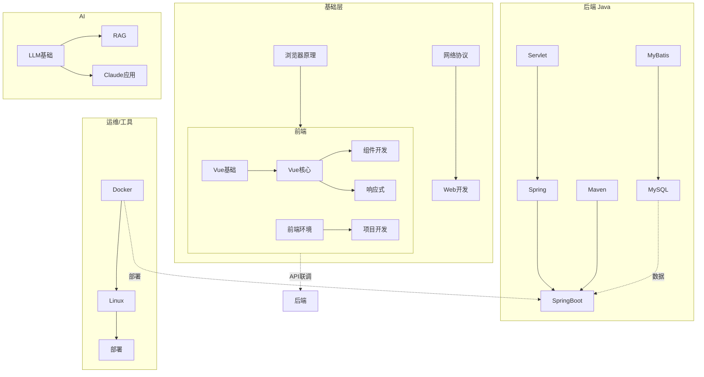
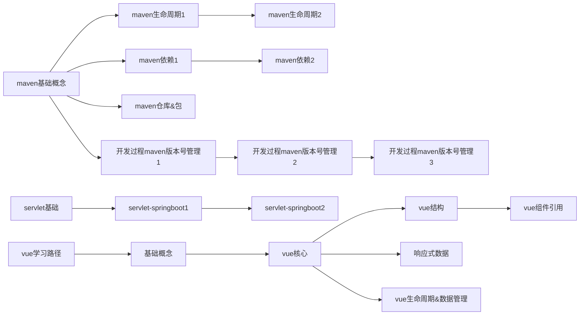

# 🗺 知识图谱 — 全库关系索引

> 本笔记是 Obsidian 公共知识库的**总入口**，记录所有笔记之间的语义关联和领域结构。
> 使用 `Ctrl+Click` / `Cmd+Click` 在图中漫游。

---

## 一、顶层领域结构

```
知识库根目录
├── 01-开发                ── 软件开发（主力领域）
├── 02-AI                  ── 人工智能
├── 03-工具                ── 开发工具 & 环境
├── 04-金融                ── 财务 & 投资
├── 05-学习                ── 学习笔记
├── 06-常用                ── 速查手册
├── 07-Clippings           ── 网页剪藏
├── inbox                  ── 收件箱（待处理）
├── assets                 ── 图片 / 附件
├── 模板                   ── Obsidian 模板
└── _index                 ── 知识图谱 & 元信息（← 你在这里）
```

---

## 二、全量笔记索引

### 🔷 01-开发 / 后端 — Java 生态

| 笔记 | 核心概念 | 连接 | 标签 |
|------|---------|------|------|
| [[01-开发/后端/Java/maven/maven基础概念]] | SNAPSHOT vs Release, 仓库, POM | → [[maven生命周期1]], → [[maven依赖1]] | `#java/maven` `#基础` |
| [[01-开发/后端/Java/maven/maven生命周期1]] | clean, compile, test, package, install | → [[maven生命周期2]], → [[maven基础概念]] | `#java/maven` `#构建` |
| [[01-开发/后端/Java/maven/maven生命周期2]] | 生命周期进阶 | → [[maven生命周期1]] | `#java/maven` `#构建` |
| [[01-开发/后端/Java/maven/maven依赖1]] | 依赖传递, scope, exclusions | → [[maven依赖2]], → [[maven基础概念]] | `#java/maven` `#依赖` |
| [[01-开发/后端/Java/maven/maven依赖2]] | 依赖冲突解决 | → [[maven依赖1]] | `#java/maven` `#依赖` |
| [[01-开发/后端/Java/maven/maven仓库&包]] | 仓库类型, 包坐标 | → [[maven基础概念]] | `#java/maven` `#仓库` |
| [[01-开发/后端/Java/maven/maven & classpath]] | classpath 机制 | → [[maven基础概念]] | `#java/maven` `#classpath` |
| [[01-开发/后端/Java/maven/maven install]] | install 部署流程 | → [[maven生命周期1]] | `#java/maven` `#部署` |
| [[01-开发/后端/Java/maven/开发过程maven版本号管理1]] | 版本管理策略 | → [[开发过程maven版本号管理2]], → [[开发过程maven版本号管理3]] | `#java/maven` `#版本管理` |
| [[01-开发/后端/Java/maven/开发过程maven版本号管理2]] | 版本号管理续 | → [[开发过程maven版本号管理1]] | `#java/maven` `#版本管理` |
| [[01-开发/后端/Java/maven/开发过程maven版本号管理3]] | 版本号管理总结 | → [[开发过程maven版本号管理1]] | `#java/maven` `#版本管理` |
| [[01-开发/后端/Java/spring/servlet基础]] | Servlet 生命周期 | → [[servlet-spring boot 1]], → [[HttpServletRequest]] | `#java/servlet` `#基础` |
| [[01-开发/后端/Java/spring/servlet-spring boot 1]] | Servlet → Spring Boot 演进 | → [[servlet基础]], → [[servlet-springboot 2]] | `#java/spring` `#演进` |
| [[01-开发/后端/Java/spring/servlet-springboot 2]] | Spring Boot 自动配置 | → [[servlet-spring boot 1]] | `#java/spring` `#自动配置` |
| [[01-开发/后端/Java/spring/spring 配置优先级]] | 配置优先级层级 | → [[spring 配置使用]] | `#java/spring` `#配置` |
| [[01-开发/后端/Java/spring/spring 配置使用]] | 配置方式(YAML/properties) | → [[spring 配置优先级]] | `#java/spring` `#配置` |
| [[01-开发/后端/Java/web/请求处理/HttpServletRequest]] | 请求对象, 参数获取 | → [[servlet基础]], → [[请求的参数绑定]] | `#java/servlet` `#请求` |
| [[01-开发/后端/Java/web/请求处理/请求的参数绑定]] | 参数绑定机制 | → [[HttpServletRequest]] | `#java/servlet` `#请求` |
| [[01-开发/后端/Java/mybatis/动态SQL]] | 动态 SQL 标签 | → [[SQL片段抽取]] | `#java/mybatis` `#sql` |
| [[01-开发/后端/Java/mybatis/SQL片段抽取]] | sql/include 复用 | → [[动态SQL]] | `#java/mybatis` `#sql` |
| [[01-开发/后端/Java/多线程/线程安全]] | synchronized, lock, volatile | — | `#java` `#并发` |

### 🔷 01-开发 / 前端

| 笔记 | 核心概念 | 连接 | 标签 |
|------|---------|------|------|
| [[01-开发/前端/vue/vue教程/vue核心]] | el, data, 模板语法, 指令 | → [[vue结构]], → [[基础概念]] | `#vue` `#核心` |
| [[01-开发/前端/vue/vue结构]] | 组件树, SFC | → [[vue核心]], → [[vue组件引用]] | `#vue` `#结构` |
| [[01-开发/前端/vue/vue开发/vue组件引用]] | 组件通信, props/emit | → [[vue结构]] | `#vue` `#组件` |
| [[01-开发/前端/vue/vue开发/vue生命周期&数据管理]] | 生命周期钩子, data/watch/computed | → [[vue核心]] | `#vue` `#生命周期` |
| [[01-开发/前端/vue/响应式数据]] | reactive, ref, 响应式原理 | → [[vue核心]], → [[基础概念]] | `#vue` `#响应式` |
| [[01-开发/前端/vue/基础概念]] | 实例, 模板, 指令, 事件 | → [[vue核心]], → [[vue学习路径]] | `#vue` `#基础` |
| [[01-开发/前端/vue/学习路径]] | Vue 学习路线 | → [[基础概念]], → [[vue核心]] | `#vue` `#学习路径` |
| [[01-开发/前端/前端环境/前端环境总结]] | 环境搭建总览 | → [[前端环境ds2]], → [[前端环境ds3]], → [[前端环境ds4]] | `#前端/环境` `#总结` |
| [[01-开发/前端/前端环境/前端环境gpt1]] | GPT 环境配置方案 | → [[前端环境gpt2]], → [[前端环境gpt3]], → [[前端环境总结]] | `#前端/环境` `#gpt` |
| [[01-开发/前端/前端环境/前端环境gpt2]] | GPT 环境配置续 | → [[前端环境gpt1]] | `#前端/环境` `#gpt` |
| [[01-开发/前端/前端环境/前端环境gpt3]] | GPT 环境配置续 | → [[前端环境gpt1]] | `#前端/环境` `#gpt` |
| [[01-开发/前端/前端环境/前端环境ds1]] | DeepSeek 环境配置 | → [[前端环境ds2]], → [[前端环境总结]] | `#前端/环境` `#ds` |
| [[01-开发/前端/前端环境/前端环境ds2]] | DS 环境配置续 | → [[前端环境ds1]], → [[前端环境总结]] | `#前端/环境` `#ds` |
| [[01-开发/前端/前端环境/前端环境ds3]] | DS 环境配置续 | → [[前端环境ds2]], → [[前端环境总结]] | `#前端/环境` `#ds` |
| [[01-开发/前端/前端环境/前端环境ds4]] | DS 环境配置续 | → [[前端环境ds3]], → [[前端环境总结]] | `#前端/环境` `#ds` |
| [[01-开发/前端/前端环境/依赖相关/依赖安装失败排查]] | 依赖安装问题定位 | → [[peerDependencies]], → [[@符号]] | `#前端/环境` `#依赖` |
| [[01-开发/前端/前端环境/依赖相关/peerDependencies]] | peerDependencies 含义 | → [[依赖安装失败排查]] | `#node` `#依赖` |
| [[01-开发/前端/前端环境/依赖相关/@符号]] | npm @scope 含义 | → [[依赖安装失败排查]] | `#node` `#npm` |
| [[01-开发/前端/前后端开发]] | 前后端协作流程 | → [[接口]], → [[前后端联调]] | `#前端` `#协作` |
| [[01-开发/前端/vscode调试]] | VSCode 断点调试 | — | `#前端` `#调试` `#vscode` |

### 🔷 01-开发 / 基础（跨领域）

| 笔记 | 核心概念 | 连接 | 标签 |
|------|---------|------|------|
| [[01-开发/基础/前后端完整逻辑]] | 请求 → 后端 → 数据库 → 响应 | → [[前后端联调]], → [[接口]] | `#基础` `#架构` |
| [[01-开发/基础/Spring开发必懂]] | IoC, DI, AOP | → [[servlet-spring boot 1]] | `#spring` `#基础` |
| [[01-开发/基础/promise]] | Promise 链式调用, async/await | → [[vue核心]] | `#js` `#异步` |
| [[01-开发/基础/前端开发必知1]] | 浏览器工作原理 | → [[前端开发必知2]], → [[前端开发必知3]] | `#前端/基础` `#浏览器` |
| [[01-开发/基础/前端开发必知2]] | 浏览器渲染机制 | → [[前端开发必知1]], → [[前端开发必知3]] | `#前端/基础` `#渲染` |
| [[01-开发/基础/前端开发必知3]] | 浏览器安全策略 | → [[前端开发必知1]], → [[前端开发必知2]] | `#前端/基础` `#安全` |

### 🔷 01-开发 / 通用

| 笔记 | 核心概念 | 连接 | 标签 |
|------|---------|------|------|
| [[01-开发/通用/接口管理/接口]] | 接口定义, RESTful | → [[接口规范实现]], → [[接口管理工具]], → [[前后端联调]] | `#开发/通用` `#接口` |
| [[01-开发/通用/接口管理/接口规范实现]] | 接口规范落地 | → [[接口]] | `#开发/通用` `#接口` |
| [[01-开发/通用/接口管理/接口管理工具]] | Swagger, YApi 等 | → [[接口]] | `#开发/通用` `#工具` |
| [[01-开发/通用/接口管理/前后端联调]] | 联调流程 & 问题排查 | → [[接口]], → [[前后端开发]] | `#开发/通用` `#联调` |
| [[01-开发/通用/版本交付/...]] | 交付流程（新建目录预留） | — | `#开发/通用` `#交付` |

### 🔷 01-开发 / 数据库

| 笔记 | 核心概念 | 连接 | 标签 |
|------|---------|------|------|
| [[01-开发/数据库/MySQL/基础]] | SQL 基础, DDL/DML/DQL | → [[基础1]], → [[命令#MySQL]] | `#数据库` `#mysql` |
| [[01-开发/数据库/MySQL/基础1]] | MySQL 进阶 | → [[基础]], → [[视图]] | `#数据库` `#mysql` |
| [[01-开发/数据库/MySQL/视图]] | 视图概念与使用 | → [[基础1]] | `#数据库` `#mysql` `#视图` |
| [[01-开发/测试/接口测试1]] | 接口测试方法 | → [[接口测试2]], → [[接口测试3]] | `#测试` `#接口` |
| [[01-开发/测试/接口测试2]] | 接口测试工具 | → [[接口测试1]] | `#测试` `#接口` |
| [[01-开发/测试/接口测试3]] | 接口测试进阶 | → [[接口测试1]] | `#测试` `#接口` |

### 🔷 01-开发 / 必知必会

| 笔记 | 核心概念 | 连接 | 标签 |
|------|---------|------|------|
| [[01-开发/必知必会/序列化]] | Java 序列化, JSON | — | `#开发/通用` `#序列化` |
| [[01-开发/必知必会/时间类型]] | 时区, LocalDateTime, Date | → [[序列化]] | `#开发/通用` `#时间` |

---

### 🔷 02-AI

| 笔记 | 核心概念 | 连接 | 标签 |
|------|---------|------|------|
| [[02-AI/基础理论/LLM 梳理]] | Transformer, 推理服务, RAG | → [[Claude code/使用技巧]] | `#ai/llm` `#基础` |
| [[02-AI/应用/Claude code/使用技巧]] | Claude Code 最佳实践 | — | `#ai/claude` `#工具` |
| [[02-AI/应用/未命名]] | （待补充） | — | `#ai` |

### 🔷 03-工具

| 笔记 | 核心概念 | 连接 | 标签 |
|------|---------|------|------|
| [[03-工具/Docker]] | 容器概念, 镜像, 挂载卷 | → [[Linux]], → [[命令#Docker]] | `#工具/docker` |
| [[03-工具/Linux]] | 文件系统, 权限, 挂载 | → [[命令#linux]], → [[Docker]] | `#工具/linux` `#系统` |
| [[03-工具/Shell]] | 常用 shell 命令和技巧 | → [[Linux]], → [[命令]] | `#工具/shell` |
| [[03-工具/Scoop]] | Windows 包管理器 | — | `#工具/scoop` `#windows` |
| [[03-工具/正则表达式1]] | 正则语法, 常用模式 | — | `#工具/regex` |

> [!NOTE] 工具笔记大多已建立双向链接
> `命令.md` 作为全局速查中心，被多个笔记引用。这是一个良好的模式。

### 🔷 04-金融

| 笔记 | 核心概念 | 连接 | 标签 |
|------|---------|------|------|
| [[04-金融/会计]] | 权责发生制, 三张表, 复式记账 | → [[股票]] | `#finance` `#会计` |
| [[04-金融/股票]] | 股票投资基础知识 | → [[会计]], → [[钱的秘密]] | `#finance` `#股票` |
| [[04-金融/钱的秘密]] | 财富思维, 理财观念 | → [[会计]], → [[Problems]] | `#finance` `#理财` |
| [[04-金融/Problems]] | 金融问题集 | → [[股票]] | `#finance` `#问题` |

### 🔷 05-学习

| 笔记 | 核心概念 |
|------|---------|
| [[05-学习/看云]] | 学习资源记录 |

### 🔷 06-常用

| 笔记 | 核心概念 | 连接 | 标签 |
|------|---------|------|------|
| [[06-常用/命令]] | 常用命令速查大全 | → [[Docker]], → [[Linux]], → [[MySQL/基础]] | `#cheatsheet` |
| [[06-常用/效率提升]] | 效率工具和方法 | — | `#效率` |

### 🔷 07-Clippings

| 笔记 | 来源 | 主题 |
|------|------|------|
| [[07-Clippings/Obsidian × Claudian × Skills：打造真正会"思考"的个人知识库-腾讯云开发者社区-腾讯云]] | 腾讯云 | Obsidian + AI 知识库构建 |
| [[07-Clippings/你为什么立即要用Obsidian+AI搭建第二大脑？保姆级教程｜Claude Code+Obsidian]] | 网络文章 | Obsidian + Claude Code 教程 |

### 🔷 inbox（待归档）

> 以下笔记在 [[inbox/triage]] 中统一管理，等待分类归档。

| 笔记 | 建议归属 | 处理优先级 |
|------|---------|:--------:|
| [[inbox/问题修复1]] ~ [[inbox/问题修复3]] | → `01-开发/前端/问题排查` | ⭐⭐⭐ |
| [[inbox/问题修复-ds1]] ~ [[inbox/问题修复-ds3]] | → `01-开发/前端/问题排查` | ⭐⭐⭐ |
| [[inbox/前端数字坑1]] ~ [[inbox/前端数字坑优化]] | → `01-开发/前端/经验教训` | ⭐⭐⭐ |
| [[inbox/前端表格索引1]] | → `01-开发/前端/组件` | ⭐⭐ |
| [[inbox/合并分页问题]] | → `01-开发/前端/经验教训` | ⭐⭐ |
| [[inbox/postMessage]] (ds + gpt) | → `01-开发/前端/浏览器API` | ⭐⭐ |
| [[inbox/gpt存储]] / [[inbox/ds存储]] | → `01-开发/前端/前端环境` | ⭐⭐ |
| [[inbox/正则表达式]] | → `03-工具/正则表达式` | ⭐⭐ |
| [[inbox/CXF]] | → `01-开发/后端/Java/集成` | ⭐ |
| [[inbox/CXF WebClient → RestTemplate]] | → `01-开发/后端/Java/集成` | ⭐ |
| [[inbox/webservice框架切换]] | → `01-开发/后端/Java/集成` | ⭐ |
| [[inbox/httpclientutil]] | → `01-开发/后端/Java/网络` | ⭐ |
| [[inbox/改造1]] ~ [[inbox/改造2]] | → `01-开发/项目/改造` | ⭐⭐ |
| [[inbox/前端1+0.2处理]] | → `01-开发/前端/经验教训` | ⭐⭐ |
| [[inbox/时间1]] ~ [[inbox/时间2]] | → `01-开发/必知必会` | ⭐ |

---

## 三、核心关系图谱

### 3.1 知识领域依赖关系



### 3.2 关键链接关系



---

## 四、数据面板

| 指标 | 数值 |
|------|:----:|
| 总笔记数 | ~110 |
| 已建立明确关系的笔记 | ~40 (36%) |
| 孤儿笔记（无对外链接） | ~70 (64%) |
| 图片附件 | 16 |
| 收件箱待归档 | ~28 |
| 主要知识领域 | 6 个 |

---

## 五、维护建议

1. **每周清理 inbox**：三叉戟决策：归档 / 删除 / 转化为项目
2. **新笔记必填 frontmatter**：`tags`, `created`, `aliases`
3. **及时更新本图谱**：新增重要笔记后顺手更新此文件
4. **优先建立双向链接**：`[[相关笔记]]` 比文件夹分类更重要
5. **使用 `#cheatsheet`** 为速查类笔记打标签，方便聚合

---

> 最后更新：2026-06-20 | 本图谱使用 Obsidian 原生 `[[wikilink]]` 和 Dataview 兼容格式
