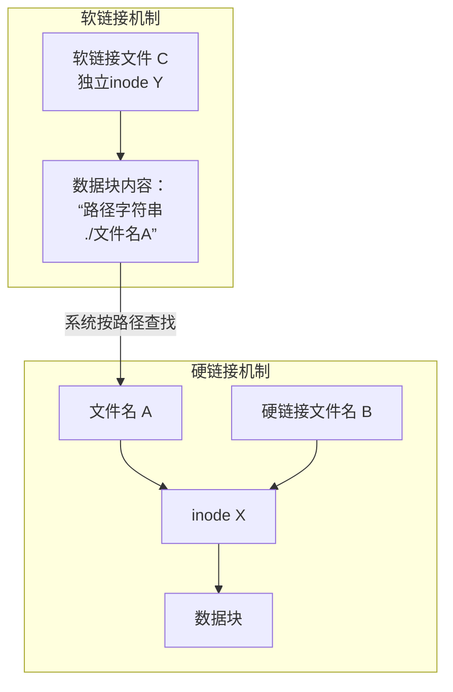

# 1. 基础

## 1.1 文件
### 1.1.1 文件组成
一个可用的文件确实由三部分组成：
-   **文件名**：人类可读的标签，存储在**目录文件**中。
-   **inode**：文件的元数据（metadata）容器，包含权限、所有者、时间戳以及最重要的——**数据块指针**（文件物理地址）。
-   **数据块**：文件的实际内容，存储在硬盘的某些块上。

**创建一个新文件时**，系统就是同时完成了这三件事：分配一个 inode，将数据写入数据块，并在目录中创建一个文件名条目指向这个 inode。

### 1.1.2 Linux一切皆文件
“Linux一切皆文件”是Unix/Linux系统最核心、最深刻的哲学理念之一。它不是一个技术实现上的死规定，而是一种**高度统一的抽象和设计哲学**。

理解了这个，就理解了Linux系统的灵魂。我们可以从以下几个层面来深入理解：

---

#### 1.1.2.1 核心思想：统一的接口

“一切皆文件”的本质是：**操作系统将几乎所有资源和操作都抽象成“文件”这个概念，并提供统一的接口（一套相同的系统调用）/命令来操作它们。**

这套接口就是最经典的：
-   `open()` - 打开
-   `read()` - 读取
-   `write()` - 写入
-   `close()` - 关闭
-   `ioctl()` - 控制（用于一些特殊操作）

**这意味着什么？**
意味着无论你要操作的是什么（硬盘上的文本、USB设备、键盘输入、甚至一块内存），在程序员和系统看来，都可以用**同一套命令、同一套思维方式**来处理。这极大地简化了系统的复杂度和开发难度。

**常用的命令 `touch`, `cat`, `tail`, `head` 等等不仅仅是用于磁盘文件，而是用于所有被Linux抽象为“文件”的东西。**

---

#### 1.1.2.2 “文件”在这里的广义含义

这里的“文件”远远超出了“.txt”、“.jpg”这种狭义的磁盘文件。它泛指 **“一个可以读写的数据流”** 或 **“一个访问入口”**。

Linux系统中几乎所有东西都被抽象成了这种“文件”：

| 种类 | 在系统中的位置 | 解读 |
| :--- | :--- | :--- |
| **普通文件** | `/home/user/file.txt` | 最传统的文件，存储磁盘上的数据。 |
| **目录** | `/home/user/` | 在Linux看来，目录就是一个包含一系列“文件名-inode”映射关系的特殊文件。 |
| **硬件设备** | `/dev/sda1` (硬盘分区)<br>`/dev/ttyS0` (串口)<br>`/dev/usbmon0` (USB设备)<br>`/dev/input/mouse0` (鼠标) | **这是“一切皆文件”最生动的体现！** 向设备文件写入数据，就是向设备发送指令（如让打印机打印）；从设备文件读取数据，就是从设备获取信息（如读取鼠标移动）。 |
| **进程和信息** | `/proc/` 和 `/sys/` 目录下的内容<br>例如：`/proc/cpuinfo` (CPU信息)<br>`/proc/123/mem` (PID为123的进程的内存) | **这简直是魔法！** 系统内核和进程的运行状态、配置参数，不再需要通过复杂的专用命令来查询，而是直接**像读取普通文本文件一样**来获取。`cat /proc/cpuinfo` 就能看CPU信息。 |
| **网络套接字** | | 网络通信的连接（Socket）也被视为一种文件，你可以对它进行读写，从而实现网络数据传输。 |
| **管道** | | 用于进程间通信，一个进程写入，另一个进程读出。它就是一个先进先出（FIFO）的数据流文件。 |

#### 1.1.2.3 一个生动的例子：理解 `/dev` 和 `/proc`

-   **你想查看CPU信息？** 不需要调用特殊的系统函数，只需要：
    ```bash
    cat /proc/cpuinfo
    ```
    （就像读取一个普通的文本文件一样）

-   **你想格式化一个U盘？** 底层操作是向U盘设备写入新的文件系统结构：
    ```bash
    sudo mkfs.ext4 /dev/sdb1
    ```
    （就像向一个文件写入数据一样，只不过这个“文件”代表你的U盘）

-   **你想修改内核参数？** 比如允许数据包转发：
    ```bash
    echo 1 > /proc/sys/net/ipv4/ip_forward
    ```
    （就像向一个配置文件写入一个数字“1”一样简单）

---

#### 1.1.2.4 带来的巨大好处

这种设计哲学带来了无与伦比的优势：

1.  **简单性**：学习和使用一套接口（文件操作），就能与系统中绝大多数组件交互。
2.  **一致性**：无论是处理本地文件、硬件还是内核状态，方法都是一样的，降低了心智负担。
3.  **易于扩展**：如果想增加一个新的硬件或功能，只要它遵循“文件”的抽象，提供 `read`/`write` 等接口，就能无缝融入整个系统，被所有现有工具（如 `cat`, `echo`, `grep`）支持。
4.  **强大灵活性**：普通文本处理工具（`cat`, `grep`, `awk`, `sed`）可以直接用于处理设备、进程信息等。例如，你可以用 `grep` 来筛选 `dmesg` 输出的内核日志，因为它们都是“数据流”。

#### 总结

所以，“Linux一切皆文件”并不是说所有东西都是存储在磁盘上的文件，而是指：

**Linux通过“文件”这个强大的抽象，为所有输入/输出（I/O）资源提供了一套统一的访问接口。它将复杂的硬件操作、内核状态查询等都简化成了最直观的文件读写操作，从而创造了一个极其简洁、一致且强大的系统环境。**

理解了这一点，你再回头看 `ls /dev` 和 `ls /proc` 的输出，就会有完全不一样的感受。你看到的不是一个简单的目录列表，而是一扇通向整个计算机硬件和软件世界的大门，而这扇大门的钥匙，就是你最熟悉的文件操作命令。

## 1.2 挂载
挂载（Mount）是操作系统内核提供的一个强大功能，它可以将一个**存储设备**（如硬盘分区、U盘、网络共享盘）或者一个**文件系统**，“安装”到当前目录树的一个空目录上。这个目录就成了访问那个存储设备的“入口”或“窗口”。

**比喻：**

- 你的电脑（Linux系统）已经有了一个C盘（根文件系统 `/`）。
    
- 你现在插入了一个**移动硬盘**。
    
- 你在C盘上创建一个空文件夹，比如叫 `D:\我的数据`（在Linux下是 `/mnt/my_data`）。
    
- **挂载**操作就是把这个移动硬盘“分配”给这个 `D:\我的数据` 文件夹。
    
- 从此以后，任何对这个文件夹的读写操作，都会被系统**重定向**到那个移动硬盘上。
    

**在Docker中的体现：**  
`-v /host/data:/container/data` 就是告诉Docker，请把宿主机上的 `/host/data` 这个目录（可以看作一个存储资源），挂载到容器内部的 `/container/data` 这个“入口”上。

**特点：**

- 操作的是**整个目录**及其下的所有内容。
    
- 是**文件系统级别**的概念。
    
- 功能强大，可以跨不同的存储设备。

## 1.3 链接

链接更像是“快捷方式”或“别名”，它为一个已存在的文件创建了另一个可以访问它的路径。它分为两种：

**硬链接 (Hard Link)**

- **是什么**：在文件系统中，一个文件的数据（称为 inode）可以有多个名字（链接）。硬链接就是直接给同一个 inode 再起一个名字。
    
- **比喻**：一个人有一个官方姓名（原名），还可以有一个绰号（硬链接）。无论你喊他的哪个名字，指代的都是这同一个人。
    
- **特点**：
    
    - 无法为目录创建硬链接（为了防止在目录树中创建循环）。
        
    - 所有硬链接地位平等，删除一个原名，绰号依然能正常访问文件数据。
        
    - 只能在**同一个文件系统**内创建。
        

**软链接 (Symbolic Link / Soft Link)**

- **是什么**：一个特殊的文件，这个文件里只存储了另一个文件的**路径信息**。
    
- **比喻**：Windows 桌面上的一个“快捷方式”文件。这个快捷方式文件本身很小，它只记录着“真正的程序在 `C:\Program Files\...`”。如果你删除了原始程序，再点击这个快捷方式就会报错“目标不存在”。
    
- **特点**：
    
    - 可以跨不同的文件系统。
        
    - 可以为目录创建软链接。
---

### 1.3.1 硬链接的本质

**“硬链接实际上就是文件名”** —— 这是最精辟的总结。

-   在 Linux 系统中，**每个文件名本质上都是一个硬链接**。
-   我们认为的“原始文件”，它的文件名只是**第一个硬链接**。
-   当你使用 `ln` 命令创建“硬链接”时，你做的事情和最初创建文件时**完全一样**：在某个目录里，添加一个新的条目（即一个新的文件名），并让它指向同一个 inode。
-   所以，`创建文件` + `创建硬链接` = **为同一个 inode 起多个名字**。

因此，所有硬链接（包括第一个文件名）都是平权的，没有“原始”和“副本”之分。

---

### 1..3.2 软链接的工作方式

**“软链接本身是另外一个文件，只是存储文件名的路径”** —— 完全正确。

-   软链接是一个**独立的、特殊类型的文件**。
-   它有**自己的 inode** 和**自己的数据块**。
-   它的数据块里不存储文件内容，只存储一个字符串——**另一个文件的路径**（例如 `/home/user/document.txt`）。
-   当你访问软链接时，系统会：
    1.  找到软链接的 inode，读取它数据块里的内容（即那个路径字符串）。
    2.  然后拿着这个路径字符串，重新开始查找过程，去定位最终的目标文件。

---

### 1.3.3 软链接可以指向硬链接

**“软链接也可以存储硬链接的路径去访问文件吧”** —— 完全可以，而且这正是常规操作！

因为软链接只认路径字符串，它根本不关心这个路径指向的到底是一个“原始文件名”还是另一个“硬链接名”。

**举个例子：**
1.  你有一个文件 `original.txt` （这是第一个硬链接）。
2.  你为它创建一个硬链接：`ln original.txt hardlink.txt`。
3.  现在你有两个等价的文件名可以访问同一份数据。
4.  你创建一个软链接指向硬链接：`ln -s hardlink.txt my_softlink`
5.  当你访问 `my_softlink` 时，系统会读取到字符串 `hardlink.txt`，然后去找到 `hardlink.txt` 这个文件名，进而找到它背后的 inode 和数据。

对于系统来说，`original.txt` 和 `hardlink.txt` 都是合法的路径，所以软链接指向其中任何一个都可以正常工作。

### 1.3.4 删除文件时，到底发生了什么？

当你执行 `rm document.txt` 时，系统实际上做了两件事：

1. **删除文件名条目**：从它所在的目录里，删除 `document.txt` 这个文件名和它对应的 inode 号之间的关联。就好像从电话簿上划掉了一个人的名字和他的电话号码。
    
2. **减少链接计数**：找到这个 inode，将其“链接计数”（Link Count）**减1**。
    

**接下来，系统会检查这个 inode 的链接计数：**

- **如果链接计数 > 0**：说明还有其他的**硬链接**（即还有其他名字）指向这个 inode。那么**什么都不做**，数据安然无恙。这就是为什么删除原文件后，硬链接依然能访问数据。
    
- **如果链接计数 == 0**：说明没有任何文件名指向这个 inode 了。此时，系统才会标记这个 inode 和它对应的**数据块**为“空闲”，允许未来被其他文件覆盖。**直到这时，数据才真正被“删除”**。
    

所以，`rm` 命令更像是一个“取消链接”的命令，而不是立即擦除数据的命令。

---

### 1.3.5 硬链接 vs 软链接 in delete

根据上面的原理，就很容易理解它们的行为了。

**对于硬链接：**

- 创建硬链接，实质是创建了一个**新的文件名**，这个新文件名**直接指向了同一个 inode**。
    
- 同时，系统会将这个 inode 的**链接计数 +1**。
    
- 因此，无论你删除哪一个文件名（原名的还是硬链接的），都只是让链接计数减1。
    
- **只要链接计数不为0**（即至少还有一个硬链接存在），inode 和数据块就永远不会被释放。
    
**对于软链接：**

- 创建软链接，是创建了一个**全新的、独立的文件**（拥有自己的 inode 和数据块）。
    
- 这个新文件的内容很特殊，它**只存储了目标文件的路径字符串**（例如 `/path/to/document.txt`）。
    
- 当你访问软链接时，系统会读它的内容，找到这个路径，然后去访问那个路径的文件。
    
- 软链接**根本不关心**目标文件的 inode 是什么，链接计数是多少。它只认路径。
    
- 所以，一旦目标文件（`/path/to/document.txt`）被删除，**无论是什么原因删除的**，软链接存储的那个路径就失效了。它变成了一个“断链”或“悬空链接”。

### 最终总结与图示

你的理解全部正确。整个过程可以用下图来清晰地展示：




# 2. 命令
[[命令#linux]]
