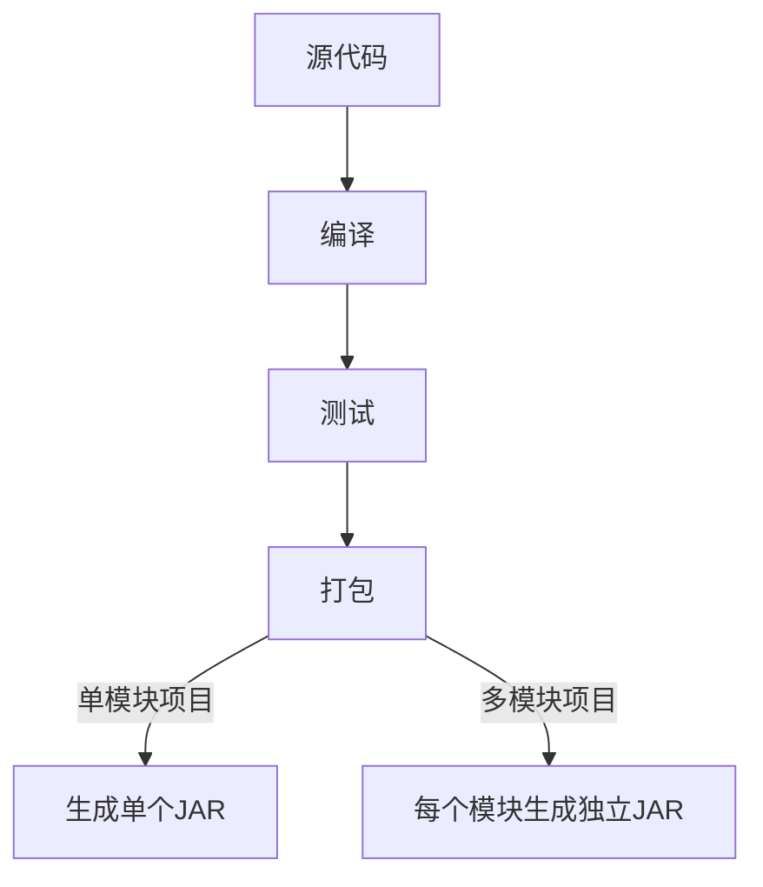
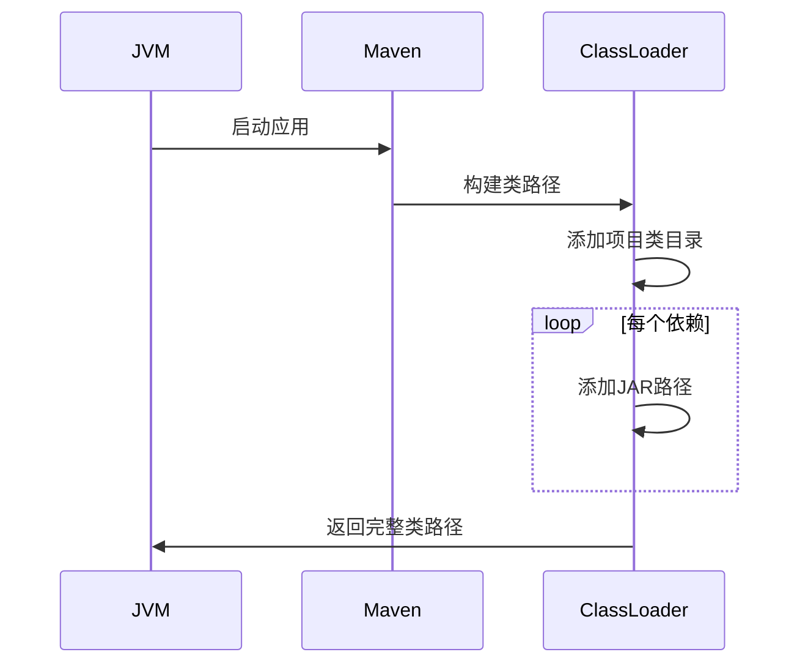

理解 Maven 命令和类路径机制是 Java 开发的关键，下面我将清晰解答您的疑问：

---

### 一、Maven 命令深度解析

#### 1. **`mvn package`**

- **打包范围**：
  - **单模块项目**：整个项目打包成一个 JAR（包含所有类文件）
  - **多模块项目**：每个子模块生成独立的 JAR
- **输出位置**：`target/` 目录下
- **内容包含**：
  - 编译后的类文件（`.class`）
  - 资源文件（`src/main/resources`）
  - **不包含**：依赖的第三方库

#### 2. **`mvn install`**

- **核心作用**：
  1. 执行 `package` 阶段的所有操作
  2. 将生成的 JAR 安装到 Maven 本地仓库
- **仓库路径**：`~/.m2/repository/groupId/artifactId/version/xxx.jar`
- **内容**：
  - 项目/模块的所有类文件
  - **不包含**：项目依赖的第三方库
- **依赖传递**：
  ```xml
  <!-- 其他项目通过此坐标引用 -->
  <dependency>
      <groupId>com.example</groupId>
      <artifactId>my-module</artifactId>
      <version>1.0.0</version>
  </dependency>
  ```

#### 3. **`mvn clean`**

- **仅删除**：项目内的构建产物（`target/` 目录）
- **不影响**：
  - Maven 本地仓库（`~/.m2/repository`）
  - 源代码（`src/` 目录）
  - 项目配置文件

---

### 二、类路径（Classpath）详解

#### 1. 类路径的组成

- **条目数量** = 1（项目类目录） + N（依赖JAR） + M（资源目录）
- **10个依赖的示例**：
  ```
  /project/target/classes:
  /home/user/.m2/repository/com/google/gson/gson/2.8.9/gson-2.8.9.jar
  /home/user/.m2/repository/org/slf4j/slf4j-api/1.7.32/slf4j-api-1.7.32.jar
  ...（其他8个JAR）
  ```

#### 2. 类路径生成机制


#### 3. 查看实际类路径
1. **代码方式**：
   ```java
   public class ClassPathPrinter {
       public static void main(String[] args) {
           String classpath = System.getProperty("java.class.path");
           System.out.println("类路径：\n" + classpath.replace(":", "\n"));
       }
   }
   ```
   
2. **Maven命令**：
   ```bash
   mvn dependency:build-classpath -Dmdep.outputFile=classpath.txt
   ```

---

### 三、Maven 多模块项目示例

#### 项目结构：
```
parent-project/
├── core-module/          # 基础模块
│   ├── src/
│   └── pom.xml
├── web-module/           # 依赖core
│   ├── src/
│   └── pom.xml
└── pom.xml               # 父POM
```

#### 命令执行流程：
```bash
# 1. 编译安装core模块
cd core-module
mvn install  # 生成core-module-1.0.jar并安装到仓库

# 2. 编译web模块（自动获取core）
cd ../web-module
mvn package  # 生成web-module-1.0.jar

# 3. web模块类路径包含：
#   web-module/target/classes
#   ~/.m2/.../core-module-1.0.jar
#   其他第三方依赖JAR...
```

---

### 四、类路径常见问题解决方案

#### 问题：`mvn install`后仍找不到类？
**排查步骤**：
1. 确认本地仓库是否存在该JAR：
   ```bash
   ls ~/.m2/repository/com/example/module/1.0/
   ```
2. 检查依赖声明：
   ```xml
   <!-- web-module/pom.xml -->
   <dependencies>
     <dependency>
       <groupId>com.example</groupId>
       <artifactId>core-module</artifactId>
       <version>1.0</version> <!-- 版本需匹配 -->
     </dependency>
   </dependencies>
   ```
3. 清理IDE缓存：
   - IntelliJ: `File > Invalidate Caches`

---

### 关键总结表
| 命令/概念       | 作用范围          | 影响位置               | 类路径影响          |
|----------------|------------------|-----------------------|---------------------|
| `mvn package`  | 当前模块         | target/目录           | 添加项目类目录       |
| `mvn install`  | 当前模块         | 本地Maven仓库         | 使其他模块可引用     |
| `mvn clean`    | 当前项目         | 删除target/目录       | 移除项目类目录       |
| 类路径         | 运行时环境       | JVM搜索路径           | 1+N+M条目组成       |

**最终结论**：
1. `mvn package`：模块级打包，生成独立JAR
2. `mvn install`：安装模块JAR到仓库，使其他项目可引用
3. 类路径 = 项目类目录 + 所有依赖JAR路径（每个JAR都是独立条目）
4. Maven仓库是依赖的"源头"，但运行时类路径指向具体文件路径

理解这些机制后，您就能精准控制Java项目的构建和依赖关系，避免常见的类找不到问题。