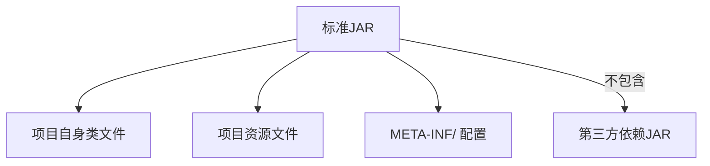
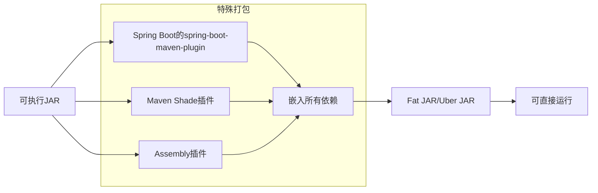
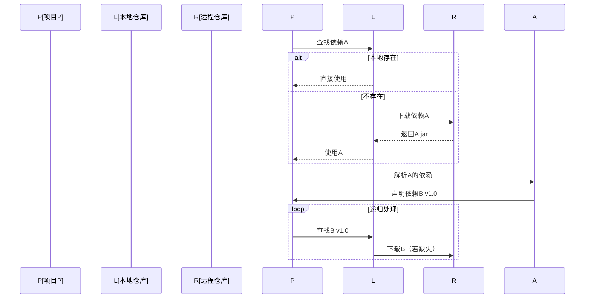
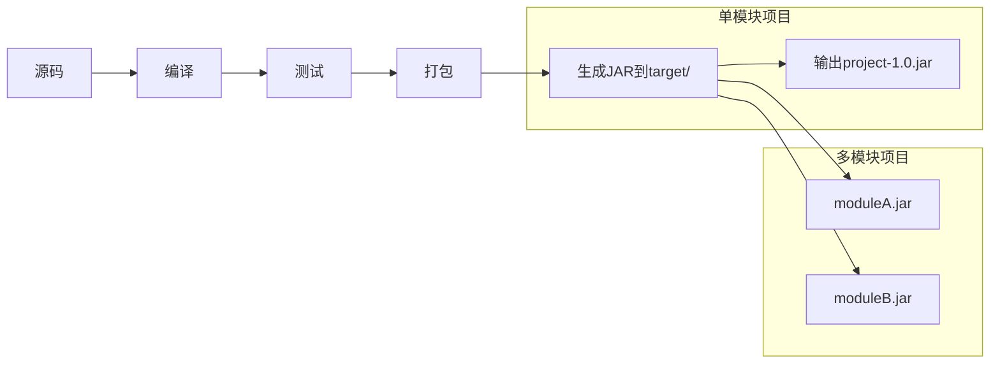
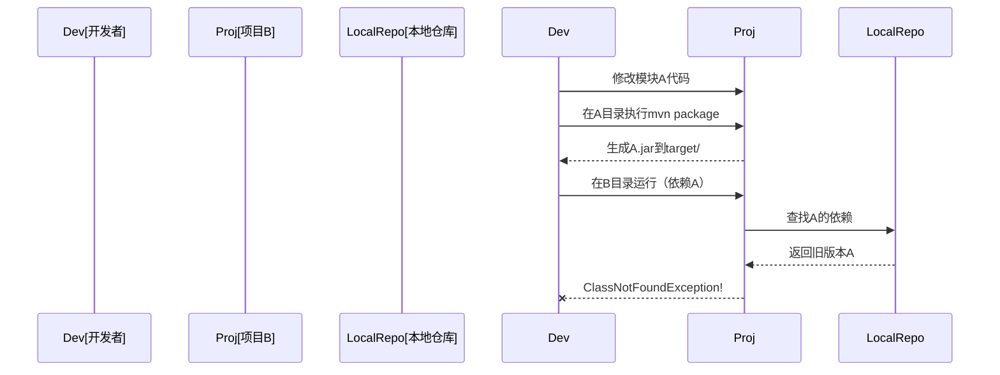

您的问题触及了 Maven 构建和依赖管理的核心机制，下面分点透彻解析：

---

### 一、JAR 包与依赖的关系

#### 1. **标准 JAR 不包含第三方依赖**

- **原因**：遵循“关注点分离”原则
- **优点**：
  - 避免依赖冲突（多个相同JAR重复）
  - 减小体积（相同依赖可复用）
  - 符合模块化设计

#### 2. **为什么有些 JAR 可直接运行？**

- **实现原理**：
  1. 解压所有依赖 JAR
  2. 合并到单个 JAR 中（包含 `BOOT-INF/lib/`）
  3. 指定特殊启动器（如 `JarLauncher`）

- **插件配置示例**：
  ```xml
  <build>
    <plugins>
      <plugin>
        <groupId>org.springframework.boot</groupId>
        <artifactId>spring-boot-maven-plugin</artifactId>
      </plugin>
    </plugins>
  </build>
  ```

---

### 二、Maven 依赖传递机制

#### 1. **依赖自动下载原理**


#### 2. **依赖范围影响传递**
| Scope    | 是否传递 | 典型场景              |
|----------|---------|----------------------|
| compile  | ✅      | 核心依赖（默认）      |
| provided | ❌      | 容器提供（如Servlet）|
| test     | ❌      | 测试依赖              |

---

### 三、`mvn package` vs `mvn install`

#### 1. **`mvn package` 本质**


#### 2. **`mvn install` 核心作用**

- **关键路径**：
  ```
  ~/.m2/repository/
  └── com
      └── example
          └── myapp
              ├── 1.0
              │   ├── myapp-1.0.jar
              │   ├── myapp-1.0.pom
              │   └── _remote.repositories
              └── maven-metadata-local.xml
  ```

---

### 四、您遇到的“找不到类”问题根源

#### 错误发生场景：


#### 为什么 `mvn package` 不够：
1. **依赖解析路径**：
   ```mermaid
   graph LR
       B[模块B] --> L[本地仓库]
       L -->|只查仓库| A[模块A]
       B -->|不检查| T[模块A的target/]
   ```

2. **解决方案对比**：
   | 操作          | 模块A状态       | 模块B能否识别     |
   |--------------|----------------|------------------|
   | `mvn package`| target/有JAR   | ❌ 不能          |
   | `mvn install`| 本地仓库有JAR   | ✅ 能            |

---

### 五、类路径的真相

#### 1. **类路径组成公式**：
   ```
   类路径 = 项目类目录 + Σ(所有依赖JAR路径) + 资源目录
   ```

#### 2. **10个依赖的实际类路径**：
   ```bash
   # 真实类路径示例（Linux）：
   /project/target/classes:\
   /home/user/.m2/repository/com/google/gson/gson/2.8.9/gson-2.8.9.jar:\
   /home/user/.m2/repository/org/apache/commons/commons-lang3/3.12.0/commons-lang3-3.12.0.jar:\
   ... # 其他8个JAR路径
   ```
   - **每个依赖JAR都是独立路径条目**
   - **条目数量** = 1 (项目类目录) + N (依赖JAR数) + M (资源目录)

#### 3. 查看类路径的方法：
   ```java
   public class ClassPathInspector {
       public static void main(String[] args) {
           String[] paths = System.getProperty("java.class.path").split(":");
           System.out.println("类路径条目数: " + paths.length);
           Arrays.stream(paths).forEach(System.out::println);
       }
   }
   ```

---

### 关键结论

1. **JAR 包本质**：
   - 标准 JAR 是 **模块级产物**（单模块=项目级）
   - Fat JAR 通过插件实现 **依赖包含**

2. **依赖解析原则**：
   - Maven **只认仓库**（不认项目 target/）
   - 传递性依赖 **自动下载**

3. **命令差异**：
   | 命令         | 产物位置       | 其他模块能否依赖 |
   |-------------|---------------|----------------|
   | `mvn package` | target/      | ❌              |
   | `mvn install` | 本地仓库      | ✅              |

4. **类路径真相**：
   - 是 **路径列表**（非递归目录）
   - 每个 JAR 都是 **独立条目**
   - 10个依赖 = 10个类路径条目 + 1个类目录

**终极解决方案**：
- 开发期：修改依赖模块后必须执行 `mvn install`
- 生产部署：
  ```bash
  # 标准方式（分离依赖）
  java -cp "target/myapp.jar:target/lib/*" com.Main
  
  # Fat JAR 方式
  java -jar target/myapp-full.jar
  ```

理解这些机制，就能彻底掌握 Maven 的构建逻辑和依赖管理精髓。