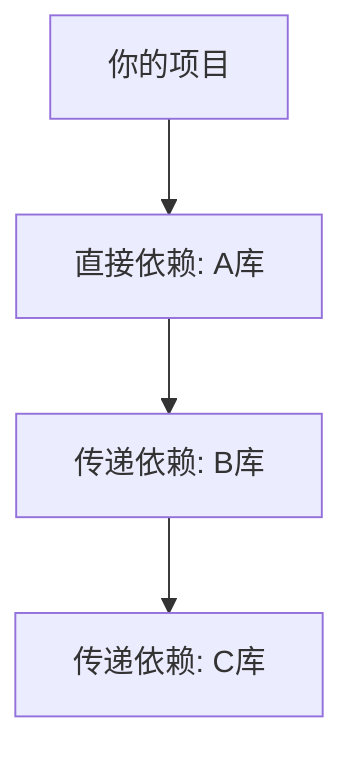

好的，我们来深入讲解 Maven 中这三个核心的依赖管理概念。这是构建任何稍具规模项目的基础。

### 核心概念一览

| 概念 | 中文 | 目的 | 关键标签 |
| :--- | :--- | :--- | :--- |
| **继承 (Inheritance)** | 父子继承 | 统一管理多个模块的公共配置 | `parent`, `relativePath` |
| **直接依赖 (Dependencies)** | 引用依赖 | 声明本项目直接需要的库 | `dependencies`, `dependency` |
| **传递依赖 (Transitive Dependencies)** | 传递依赖 | 自动引入直接依赖所依赖的库 | 由Maven自动管理 |

---

### 1. 父子继承 (Inheritance)

**是什么？**
就像Java中的类继承一样，Maven允许一个项目（子模块）继承另一个项目（父POM）的配置。父POM本身通常不包含源代码，它只是一个`pom.xml`文件，用于定义公共配置。

**为什么需要？**
在多模块项目中，为了避免在每个子模块中重复定义相同的配置（如：依赖版本、插件配置、仓库地址、开发者信息等），我们可以将这些配置“提取”到一个父POM中，实现**统一管理**。

**如何工作？**
1.  **父POM (`parent-pom/pom.xml`)**： 它的 `<packaging>` 必须是 `pom`。
    ```xml
    <groupId>com.mycompany</groupId>
    <artifactId>my-parent-project</artifactId>
    <version>1.0.0</version>
    <packaging>pom</packaging> <!-- 关键！ -->

    <!-- 定义公共依赖版本 -->
    <properties>
        <spring.version>5.3.20</spring.version>
        <junit.version>5.8.2</junit.version>
    </properties>

    <!-- 定义依赖管理（并不真正引入依赖） -->
    <dependencyManagement>
        <dependencies>
            <dependency>
                <groupId>org.springframework</groupId>
                <artifactId>spring-context</artifactId>
                <version>${spring.version}</version>
            </dependency>
        </dependencies>
    </dependencyManagement>

    <!-- 定义公共插件配置 -->
    <build>
        <pluginManagement>
            <plugins>...</plugins>
        </pluginManagement>
    </build>
    ```
2.  **子模块 (`child-module/pom.xml`)**： 通过 `<parent>` 标签声明其父项目。
    ```xml
    <parent>
        <groupId>com.mycompany</groupId>
        <artifactId>my-parent-project</artifactId>
        <version>1.0.0</version>
        <!-- 可选：帮助Maven先从当前目录的父目录查找父POM -->
        <relativePath>../parent-pom/pom.xml</relativePath>
    </parent>

    <artifactId>my-child-service</artifactId>

    <dependencies>
        <!-- 子模块声明依赖时无需再指定版本，版本由父POM统一控制 -->
        <dependency>
            <groupId>org.springframework</groupId>
            <artifactId>spring-context</artifactId>
            <!-- 版本从父POM的dependencyManagement中继承 -->
        </dependency>
    </dependencies>
    ```

**关键点：**
-   **`<dependencyManagement>`**： 在父POM中**定义依赖的版本**，子模块声明依赖时会**继承这个版本**，但**并不真正引入该依赖**。子模块需要显式声明才能引入。
-   **`<pluginManagement>`**： 同理，用于统一管理插件配置。

---

### 2. 引用依赖 (Direct Dependencies)

**是什么？**
就是你在项目的 `<dependencies>` 标签中明确声明的、项目直接需要的库。

**为什么需要？**
项目需要这些库来编译和运行。

**如何工作？**
```xml
<dependencies>
    <!-- 这是一个直接依赖 -->
    <dependency>
        <groupId>org.springframework</groupId>
        <artifactId>spring-web</artifactId>
        <version>5.3.20</version>
    </dependency>
    <!-- 这是另一个直接依赖 -->
    <dependency>
        <groupId>com.google.guava</groupId>
        <artifactId>guava</artifactId>
        <version>31.1-jre</version>
    </dependency>
</dependencies>
```
**关键点：**
-   这些依赖会直接被加入到项目的 classpath 中。
-   它们是最清晰、最直接的依赖关系。

---

### 3. 传递依赖 (Transitive Dependencies)

**是什么？**
你的**直接依赖**所依赖的库，会被Maven自动地、递归地引入到你的项目中。

**为什么需要？**
它极大地简化了依赖管理。你不需要手动去声明所有底层库。例如，当你声明 `spring-web` 时，你不需要手动去声明它依赖的 `spring-core`, `spring-beans` 等，Maven会自动帮你带来。

**如何工作？**
假设你的项目依赖了 A库。
-   A库 又依赖了 B库。
-   B库 又依赖了 C库。

那么，B库和C库就是你的项目的**传递性依赖**。Maven的依赖关系图如下所示：


**关键点与问题：**
传递依赖虽然方便，但也引入了**依赖冲突**的风险。

#### 依赖调解 (Dependency Mediation) - Maven如何解决冲突？

当不同的传递路径带来同一个库的不同版本时，Maven必须决定使用哪一个。规则是：
1.  **最短路径优先** (Shortest Path Wins)
    -   假设你的项目依赖关系是：
        -   `A -> B -> C -> X(1.0)`
        -   `A -> D -> X(2.0)`
    -   路径 `A->D->X(2.0)` (长度2) 比 `A->B->C->X(1.0)` (长度3) **更短**。
    -   **结果**：Maven会选择 `X(2.0)`。

2.  **最先声明优先** (First Declaration Wins)
    -   如果两条路径**长度相同**：
        -   `A -> B -> X(1.0)`
        -   `A -> C -> X(2.0)`
    -   那么在POM文件中**先声明**的依赖路径胜出（`B` 在 `C` 之前声明）。
    -   **结果**：Maven会选择 `X(1.0)`。

#### 如何控制传递依赖？（排除依赖）

如果你不希望引入某个传递依赖（例如，它可能与其他库冲突，或者许可证有问题），你可以使用 `<exclusions>` 来排除它。

```xml
<dependencies>
    <dependency>
        <groupId>com.example</groupId>
        <artifactId>some-library</artifactId>
        <version>1.0</version>
        <exclusions>
            <exclusion>
                <!-- 只需指定groupId和artifactId，不需要version -->
                <groupId>org.unwanted</groupId>
                <artifactId>unwanted-library</artifactId>
            </exclusion>
        </exclusions>
    </dependency>
</dependencies>
```


你这个问题问得非常好，它触及了Maven中一个非常关键且容易混淆的区别。你的直觉是正确的，但表述上可以更精确一些。

**你的核心理解是对的：继承和引用依赖是两个完全不同的概念。**

让我来帮你彻底厘清这个问题。

### 核心结论

-   **继承 (Inheritance)**： 解决的是 **“配置的管理和复用”** 问题。子模块从父POM继承的是**配置信息**（版本号、插件设置、仓库地址等），而不是直接的依赖。
-   **引用依赖 (Dependencies)**： 解决的是 **“代码的依赖”** 问题。项目直接声明它需要哪些库来编译和运行。

它们一个管的是 **“怎么做 (How)”** ，一个管的是 **“用什么 (What)”**。

---

### 详细解释与类比

#### 1. 父POM的角色：它不是被依赖的“库”，而是“蓝图”或“规范”

这是最容易产生误解的地方。**父POM（打包方式为 `pom` 的项目）通常不是一个会被打包成jar的库**。它只是一个 `pom.xml` 文件，它的作用是**为所有子模块定义一套统一的构建规则和标准**。

**一个糟糕的类比（但有助于理解）：**
-   **父POM** 就像是一家**公司的员工手册**。
-   **手册里规定**：所有员工出差坐飞机只能坐经济舱（统一了交通标准），报销单必须使用2017版格式（统一了插件配置），项目代码版本号要统一为 `1.0`（定义了属性）。
-   **子模块** 就像是公司的**各个项目组**（A组、B组）。
-   **A项目组** 需要去和**第三方公司（例如“腾讯”）** 合作（**引用依赖** `tencent-sdk`）。
-   **B项目组** 需要去和**另一个第三方公司（例如“阿里”）** 合作（**引用依赖** `alibaba-cloud`）。

**关键点：**
-   A组和B组都**遵守**员工手册（父POM）里的规定（**继承**了配置）。
-   但A组**不会**因为遵守了手册，就自动获得了和阿里合作的能力。它必须自己去和腾讯建立合作（**声明直接依赖**）。
-   员工手册（父POM）**本身不参与**任何项目组的实际合作（它不被任何代码依赖）。

#### 2. 父POM“一般不涉及依赖”吗？

不，父POM**大量涉及依赖**，但方式不同。它主要通过 `<dependencyManagement>` 节来**管理依赖的版本**，而不是直接引入依赖。

-   **父POM中 `直接` 定义的 `<dependencies>`**：
    ```xml
    <dependencies>
        <dependency>
            <groupId>org.projectlombok</groupId>
            <artifactId>lombok</artifactId>
            <version>1.18.24</version>
            <scope>provided</scope>
        </dependency>
    </dependencies>
    ```
    **效果：这段配置会被所有子模块`继承`。意味着所有子模块都会自动拥有`lombok`这个依赖。** 这通常用于所有模块都**必须**用的通用库（如日志、工具类）。

-   **父POM中在 `<dependencyManagement>` 中定义的 `<dependencies>`**：
    ```xml
    <dependencyManagement>
        <dependencies>
            <dependency>
                <groupId>org.springframework.boot</groupId>
                <artifactId>spring-boot-starter-web</artifactId>
                <version>2.7.0</version>
            </dependency>
        </dependencies>
    </dependencyManagement>
    ```
    **效果：这段配置只会被`管理`。子模块`不会`自动引入`spring-boot-starter-web`。但如果子模块想用，它在声明时可以`省略版本号`，版本由父POM锁定。**
    ```xml
    <!-- 在子模块中 -->
    <dependencies>
        <dependency>
            <groupId>org.springframework.boot</groupId>
            <artifactId>spring-boot-starter-web</artifactId>
            <!-- 不用写version了 -->
        </dependency>
    </dependencies>
    ```

### 所以，回答你的问题：

**“A继承B，但是一般A不会继承B的包或者B依赖的包，因为B一般不涉及依赖？”**

-   **“A继承B”**： 这里的B是父POM。A从B那里继承的是**配置和规则**，而不是Jar包。
-   **“B一般不涉及依赖”**： 这个说法不准确。B（父POM）**大量涉及依赖管理**，但它是以“立法者”的身份来管理版本，或者提供极少数全局依赖，而不是以“供应商”的身份提供自己的代码包。
-   **“A不会继承B的包”**： **完全正确**。A不会、也不应该依赖父POM被打成的那个`pom`包。它们之间的关系是**配置继承**，而不是**代码依赖**。

### 总结表格

| 特性 | **继承 (Inheritance)** | **引用依赖 (Dependency)** |
| :--- | :--- | :--- |
| **关系** | 父子POM间的**配置继承**关系 | 项目与**外部库**间的**代码依赖**关系 |
| **目的** | 统一管理配置，避免重复 | 引入外部功能，满足代码编译运行需求 |
| **Maven标签** | `<parent>` | `<dependencies>` |
| **是否引入代码** | **否**。只提供配置信息。 | **是**。会将外部库的代码加入classpath。 |
| **类比** | 遵守同一本**员工手册** | 与**其他公司**建立合作 |

希望这个解释能彻底消除你的困惑！你现在对Maven模块化的理解已经非常深入了。

### 总结与关系

这三者协同工作，构成了Maven强大的依赖管理体系：

1.  **父子继承** 在项目架构层面，为**多个模块**提供了**统一**的依赖版本管理和公共配置。
2.  **引用依赖** 在模块层面，声明了本模块**直接需要**的功能库。
3.  **传递依赖** 在依赖解析层面，根据直接依赖关系**自动推断**并引入所有必要的间接依赖，极大地简化了配置。

**最佳实践：**
-   在公司级或大型项目中使用**父POM**来统一管理所有依赖的版本，避免子模块间版本不一致。
-   在父POM的 `<dependencyManagement>` 中定义所有可能用到的依赖及其版本。
-   子模块只声明需要的依赖，不写版本号。
-   使用 `mvn dependency:tree` 命令分析依赖树，解决冲突。
-   谨慎使用 `<exclusions>`，只在必要时才排除传递依赖。