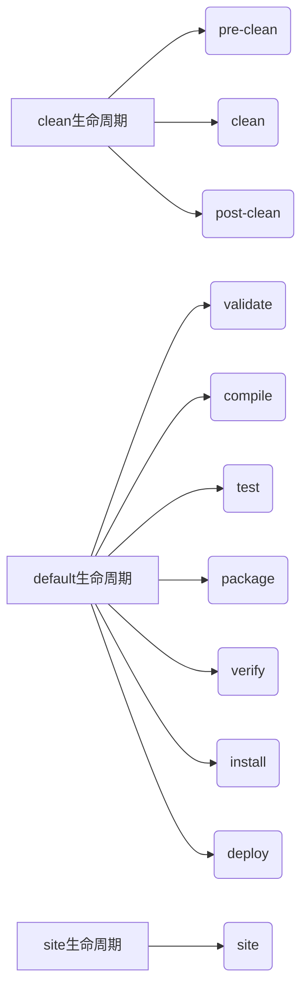

`mvn clean install` 和 `mvn install` 是 Maven 构建中的两个常见命令，它们有明确的区别。以下是详细对比：

---

### 🧹 核心区别总结
| **特性**             | `mvn install`                     | `mvn clean install`               |
|----------------------|----------------------------------|----------------------------------|
| **清理构建输出**      | ❌ 不清理 `target` 目录           | ✅ 先执行 `clean` 删除 `target`  |
| **构建过程**          | 增量构建（复用已有编译文件）      | 全新构建（强制从头开始）         |
| **构建可靠性**        | 可能受旧文件影响                 | 避免旧文件污染，结果更可靠       |
| **构建时间**          | 较短（跳过已编译文件）           | 较长（需重新编译所有代码）       |
| **适用场景**          | 小改动后的快速构建               | 重要发布前构建、解决奇怪构建问题 |

---

### 🔧 技术原理详解
#### 1. Maven 生命周期阶段
Maven 构建分为三个独立生命周期：


- `mvn install` → **仅触发 default 生命周期**，执行到 `install` 阶段
- `mvn clean install` → **先执行 clean 生命周期，再执行 default 生命周期**

---

#### 2. 文件系统操作对比
假设项目结构如下：
```
my-project/
├── src/
├── target/  # 构建输出目录
│   ├── classes/
│   ├── generated-sources/
│   └── my-app.jar
```

| **命令**         | `target/` 目录变化               | 效果说明                     |
|------------------|--------------------------------|----------------------------|
| **`mvn install`** | 保留旧文件，增量更新修改部分     | 可能残留废弃的 `.class` 文件 |
| **`mvn clean install`** | 1. 先删除整个 `target/` 目录<br>2. 重新创建目录并全量编译 | 彻底干净的构建环境           |

---

### ⚠️ 为什么需要 `clean`？—— 常见问题案例
#### 场景 1：类文件残留导致 NoSuchMethodError
```java
// 修改前
public class Service {
    public void oldMethod() {...}
}

// 修改后（删除 oldMethod）
public class Service {
    public void newMethod() {...}
}
```
- **`mvn install` 问题**：  
  旧版本 `Service.class` 仍存在于 `target/` 中，调用处尝试访问 `oldMethod()` 导致运行时错误
- **`mvn clean install` 修复**：  
  删除旧类文件，确保只存在 `newMethod()`

#### 场景 2：资源文件未更新
```bash
# 修改 src/main/resources/app.conf
echo "new_config=value" > src/main/resources/app.conf

# 运行 mvn install
# target/classes/app.conf 仍是旧版本！
```
- **原因**：Maven 资源插件可能未检测到变更
- **解决**：`clean` 强制刷新资源文件

---

### 🚀 性能与可靠性权衡
| **指标**       | `mvn install`       | `mvn clean install` | 建议         |
|---------------|--------------------|--------------------|--------------|
| **构建时间**   | ⏱️ 快 (省去清理和全量编译) | ⏱️ 慢 (全量重建)    | 日常开发用增量 |
| **结果可靠性** | ⚠️ 中 (可能受旧文件影响)   | ✅ 高 (绝对干净)    | 发布前用 clean |
| **磁盘占用**   | 📦 高 (累积旧文件)       | 📦 低 (每次清理)    |              |

---

### 🔍 如何验证构建是否干净？
检查构建日志中的时间戳：
```diff
# mvn install 日志（增量构建）
[INFO] --- maven-compiler-plugin:3.8.1:compile (default-compile) @ my-app ---
[INFO] Nothing to compile - all classes are up to date

# mvn clean install 日志（全量构建）
[INFO] --- maven-clean-plugin:3.2.0:clean (default-clean) @ my-app ---
[INFO] Deleting /project/target
...
[INFO] --- maven-compiler-plugin:3.8.1:compile (default-compile) @ my-app ---
[INFO] Changes detected - recompiling the module!
```

---

### 🛠️ 最佳实践指南
1. **日常开发** → `mvn install`  
   （节省时间，快速验证小改动）
   ```bash
   # 修改单个文件后快速构建
   mvn install
   ```

2. **重要场景必须用 clean**：
   - 发布生产版本前
   - 切换 Git 分支后
   - 依赖库版本升级后
   - 遇到无法解释的构建/运行时错误
   ```bash
   # 发布前的可靠构建
   mvn clean install -DskipTests
   ```

3. **IDE 集成技巧**：  
   在 IntelliJ/Eclipse 中运行 Maven 时勾选 `Clean` 选项：  
   

---

### 💡 高级替代方案
1. **部分清理**（手动删除特定文件）：
   ```bash
   # 只清理编译的类文件
   find . -name "*.class" -delete
   mvn install
   ```

2. **使用 `clean` 插件跳过**（不推荐）：
   ```xml
   <plugin>
     <artifactId>maven-clean-plugin</artifactId>
     <configuration>
       <skip>true</skip> <!-- 禁用 clean -->
     </configuration>
   </plugin>
   ```

3. **结合 `git clean` 彻底重置**：
   ```bash
   git clean -xdf # 删除所有未跟踪文件（包括 target）
   mvn install
   ```

---

### ✅ 终极结论
| **命令**           | 是否包含 clean | 推荐场景                          |
|--------------------|---------------|---------------------------------|
| `mvn install`      | ❌ 否          | 日常开发、快速迭代                |
| `mvn clean install`| ✅ 是          | 发布构建、解决诡异问题、环境切换时 |

> 📌 **黄金法则**：  
> **当你怀疑构建结果时，总是使用 `clean`！**  
> 它能解决 90% 由残留文件引起的“灵异”构建问题。


[[maven生命周期2]]
