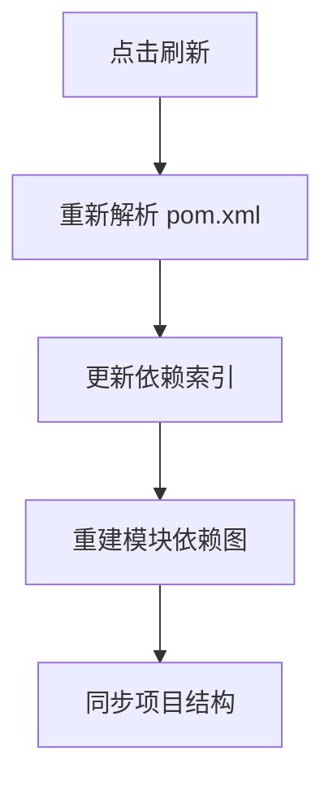

[[maven生命周期1]]

---

### 一、Maven 生命周期与阶段详解
#### 1. **三大生命周期**
| **生命周期**  | **作用**     | **核心阶段**                                                           |
| --------- | ---------- | ------------------------------------------------------------------ |
| `clean`   | 清理构建产物     | `pre-clean` → `clean` → `post-clean`                               |
| `default` | 项目构建部署（核心） | `validate` → `compile` → `test` → `package` → `install` → `deploy` |
| `site`    | 生成项目文档     | `pre-site` → `site` → `post-site` → `site-deploy`                  |

#### 2. **default 生命周期核心阶段**
| **阶段**            | **作用**                                                                 | **触发命令**          | **增量行为**                              | **输出目录**          |
|---------------------|-------------------------------------------------------------------------|----------------------|------------------------------------------|----------------------|
| `validate`          | 验证项目配置正确性（POM 完整性）                                          | `mvn validate`       | ❌                                        | -                    |
| `compile`           | **编译主代码**                                                           | `mvn compile`        | ✅ 仅编译修改过的文件                      | `target/classes`     |
| `test-compile`      | 编译测试代码                                                             | `mvn test-compile`   | ✅ 仅编译修改过的测试代码                  | `target/test-classes`|
| `test`              | **运行单元测试**（Surefire 插件）                                         | `mvn test`           | ✅ 仅运行受影响测试                        | `target/surefire-reports` |
| `package`           | 打包构建产物（JAR/WAR）                                                  | `mvn package`        | ❌ 全量打包                                | `target/*.jar`       |
| `verify`            | 运行集成测试/质量检查（Failsafe 插件）                                    | `mvn verify`         | ❌ 全量验证                                | `target/failsafe-reports` |
| `install`           | 安装到本地仓库                                                           | `mvn install`        | ❌ 全量安装                                | `~/.m2/repository`   |
| `deploy`            | 部署到远程仓库                                                           | `mvn deploy`         | ❌ 全量部署                                | 远程仓库             |

> 📌 **关键特性**：
> - **增量范围**：仅 `compile` 和 `test` 阶段有智能增量
> - **阶段依赖**：执行后阶段会**自动触发**前序阶段（如 `mvn install` 会先执行 `compile` 和 `test`）
> - 当执行 `mvn clean` 时，Maven 会**完整执行 clean 生命周期的三个阶段**，**`mvn clean` 始终会执行 `post-clean` 阶段**，但该阶段默认无操作。


---

### 二、常用命令与注意点
#### 1. 高频命令
| **命令**                  | **等效阶段序列**                     | **使用场景**                          | **注意点**                              |
|--------------------------|-------------------------------------|--------------------------------------|----------------------------------------|
| `mvn clean install`      | `clean` + `default` 到 `install`    | 发布前可靠构建                        | 全量重编译，避免残留文件问题            |
| `mvn compile`            | `validate` → `compile`              | 快速验证主代码                        | **不编译测试代码**                      |
| `mvn test`               | 到 `test`                           | 运行单元测试                          | **不运行集成测试**                      |
| `mvn package -DskipTests`| 到 `package`（跳过测试）             | 快速打包                              | 可能包含未测试代码                      |
| `mvn dependency:tree`    | N/A                                 | 分析依赖冲突                          | 独立命令，不触发构建                    |

#### 2. 测试控制技巧
```bash
# 运行单个测试类
mvn -Dtest=UserServiceTest test

# 运行匹配模式的测试
mvn -Dtest="*ServiceTest" test

# 跳过测试
mvn install -DskipTests      # 编译测试代码但不运行
mvn install -Dmaven.test.skip=true  # 完全跳过测试编译和运行
```

#### 3. 多模块优化
```bash
# 仅构建指定模块
mvn -pl module-core compile 

# 构建模块及其依赖
mvn -pl module-web -am install 

# 并行构建（提升速度）
mvn -T 1C install  # 每个CPU核心1线程
```

---

### 三、IDEA 中 Maven 刷新机制
#### 1. 刷新按钮的本质
IDEA 的 Maven 刷新按钮（Reimport）执行以下操作：


#### 2. 等效命令行方案
| **IDEA 操作**                | **命令行等效**                     | **作用范围**                     |
|------------------------------|----------------------------------|--------------------------------|
| 单模块刷新（右键模块 → Reimport） | `mvn idea:module`               | 更新当前模块配置                |
| 全局刷新（工具栏刷新按钮）      | `mvn idea:idea`                 | 重建整个项目结构                |
| 依赖下载更新                  | `mvn dependency:resolve`        | 强制重新下载依赖                |

> ⚠️ **注意**：  
> `mvn idea:idea` 会生成 `.iml`/`.ipr` 文件，可能覆盖 IDE 配置，**慎用**！

#### 3. 安全刷新方案（推荐）
```bash
# 1. 更新依赖但不修改项目结构
mvn dependency:resolve

# 2. 仅更新当前模块配置
mvn idea:module -N

# 3. 增量刷新（IDEA 独有，无直接命令替代）
#    手动执行：View → Tool Windows → Maven → 点击刷新图标
```

---

### 四、增量编译原理总结
| **场景**               | `compile` 行为                  | `test` 行为                     |
|------------------------|--------------------------------|--------------------------------|
| **修改主代码**         | 重新编译修改的文件+依赖类        | 重新运行受影响测试              |
| **修改测试代码**       | ❌ 不重新编译主代码              | 重新编译修改的测试+运行         |
| **新增文件**           | 编译新文件                      | 运行新测试                      |
| **删除文件**           | 移除旧 `.class` 文件            | 跳过已删除测试                  |
| **修改资源文件**       | 复制更新后的资源到 `target/`    | 不触发测试重运行                |

> 🔬 **技术原理**：  
> Maven 通过比较**文件时间戳**和**依赖分析**实现增量：
> - 缓存位置：`target/maven-status/maven-compiler-plugin/compile/default-compile/`
> - 依赖跟踪：解析 `import` 语句构建类依赖图

---

### 五、避坑指南
1. **增量失效场景**：
   ```bash
   # 修改 pom.xml 依赖 → 全量重编译
   # 切换 Git 分支 → 必须 clean
   # 使用 Lombok 等注解处理器 → 可能需手动清理
   ```

2. **测试污染问题**：
   ```bash
   # 静态变量导致测试间干扰
   mvn test -DforkCount=1  # 强制新建 JVM
   ```

3. **IDE 与命令行差异**：
   ```bash
   # IDEA 内置编译可能跳过资源过滤
   # 始终用命令行验证正式构建
   mvn clean package
   ```

---

### 六、最佳实践总结
1. **日常开发**：
   ```bash
   mvn compile     # 保存时快速检查
   mvn test        # 提交前运行测试
   ```

2. **持续集成**：
   ```bash
   mvn clean verify  # 完整质量检查
   ```

3. **依赖更新**：
   ```bash
   mvn dependency:resolve -U  # 强制更新 SNAPSHOT
   ```

4. **IDEA 协作**：
   - 开启自动导入：`Settings → Build Tools → Maven → Importing → Import Maven projects automatically`
   - 避免提交 IDE 文件：将 `.idea/` 和 `*.iml` 加入 `.gitignore`

> 💡 **终极口诀**：  
> **小改用增量，发布必 Clean；  
> 测试分阶段，刷新靠 IDE；  
> 依赖勤更新，多模并行建。**

