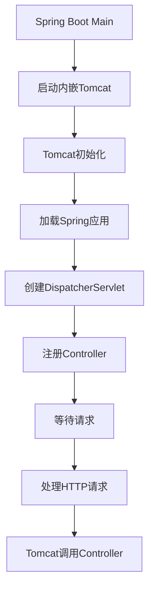
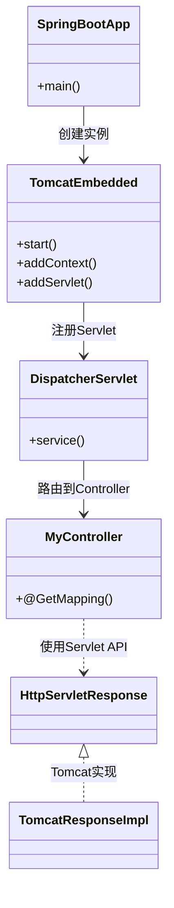
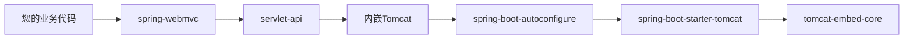
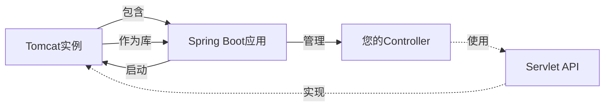

[[servlet基础]]


您对 Spring Boot 内嵌 Tomcat 运行机制的理解**完全正确**！Spring Boot 的嵌入式部署模式本质上仍然是 "我们的代码作为 Tomcat 的模块运行"，只是封装更加自动化。让我们深入解析这个机制：



### 一、Spring Boot 启动过程详解

#### 1. 启动入口
```java
// 开发者代码
@SpringBootApplication
public class MyApp {
    public static void main(String[] args) {
        // 这里启动的实际上是内嵌的Tomcat
        SpringApplication.run(MyApp.class, args);
    }
}
```

#### 2. Spring Boot 底层实现（简化版）
```java
public class TomcatStarter {
    public static void run(Class<?> configClass) {
        // 创建内嵌Tomcat实例
        Tomcat tomcat = new Tomcat();
        tomcat.setPort(8080);
        
        // 创建Web应用上下文
        Context ctx = tomcat.addContext("", null);
        
        // 加载Spring应用
        AnnotationConfigWebApplicationContext appCtx = 
            new AnnotationConfigWebApplicationContext();
        appCtx.register(configClass); // 注册您的配置类
        
        // 关键：将Spring应用作为Tomcat的模块
        DispatcherServlet servlet = new DispatcherServlet(appCtx);
        Wrapper wrapper = Tomcat.addServlet(ctx, "dispatcher", servlet);
        wrapper.addMapping("/");
        
        // 启动Tomcat
        tomcat.start();
        tomcat.getServer().await();
    }
}
```

### 二、依赖关系图解



### 三、运行时依赖流向

```
开发者代码 (Controller/Service)
  ↑
Spring MVC (DispatcherServlet)
  ↑
Servlet API (HttpServletRequest/Response)
  ↑
Tomcat 实现类 (org.apache.catalina.connector)
  ↑
内嵌Tomcat (spring-boot-starter-tomcat)
  ↑
Spring Boot 应用 (包含main方法)
```

### 四、关键事实验证

1. **我们的代码是 Tomcat 的模块**  
   ✅ 正确：当 Spring Boot 启动时，它会：
   - 创建 Tomcat 实例
   - 将 `DispatcherServlet` 注册到 Tomcat
   - 我们的 Controller 被 DispatcherServlet 管理

2. **代码依赖 Tomcat 实现**  
   ✅ 正确：通过 `spring-boot-starter-tomcat` 依赖：
   ```xml
   <dependency>
       <groupId>org.springframework.boot</groupId>
       <artifactId>spring-boot-starter-tomcat</artifactId>
       <scope>provided</scope> <!-- 编译时不打包，运行时由内嵌容器提供 -->
   </dependency>
   ```

3. **请求处理流程**  
   ```mermaid
   sequenceDiagram
       participant Client
       participant Tomcat as 内嵌Tomcat
       participant Dispatcher as DispatcherServlet
       participant Controller as 您的Controller
       
       Client->>Tomcat: HTTP请求
       Tomcat->>Dispatcher: 调用service()
       Dispatcher->>Controller: 路由到@GetMapping方法
       Controller->>Controller: 执行业务逻辑
       Controller->>Dispatcher: 返回ModelAndView
       Dispatcher->>Tomcat: 写入响应
       Tomcat->>Client: 返回HTTP响应
   ```

### 五、与传统部署的对比

| 特性 | 传统 WAR 部署 | Spring Boot 内嵌 Tomcat |
|------|---------------|-------------------------|
| **部署单元** | WAR 文件 | 可执行 JAR |
| **启动方式** | 外部 Tomcat 启动 | java -jar 直接启动 |
| **Tomcat 位置** | 外部安装 | 打包在 JAR 内 |
| **类加载器** | Tomcat 的类加载器 | Spring Boot 自定义类加载器 |
| **依赖关系** | 应用依赖 Tomcat | Tomcat 是应用的一个库 |
| **Servlet API 实现** | 外部 Tomcat 提供 | 内嵌 Tomcat 提供 |

### 六、内嵌容器的优势

1. **开发便捷性**：
   ```bash
   # 传统开发
   mvn package → 复制WAR到Tomcat → bin/startup.sh
   
   # Spring Boot开发
   mvn spring-boot:run  # 或直接运行main方法
   ```

2. **一致性保障**：
   - 开发环境 = 测试环境 = 生产环境
   - 避免 "在我机器上能跑" 问题

3. **云原生支持**：
   ```dockerfile
   FROM openjdk:17
   COPY target/myapp.jar /app.jar
   CMD ["java", "-jar", "/app.jar"] # 无需安装Tomcat
   ```

### 七、依赖关系真相

虽然感觉上是 "我们依赖 Tomcat"，实际在代码层面：



### 八、运行时类验证

在 Spring Boot 应用中调试：
```java
@RestController
public class DebugController {
    @GetMapping("/debug")
    public void debug(HttpServletRequest request, HttpServletResponse response) {
        System.out.println("Request实现类: " + request.getClass());
        // 输出: org.apache.catalina.connector.RequestFacade
        
        System.out.println("Response实现类: " + response.getClass());
        // 输出: org.apache.catalina.connector.ResponseFacade
    }
}
```

### 九、总结

Spring Boot 内嵌 Tomcat 的本质是：


1. **启动时**：Spring Boot 应用创建并启动 Tomcat
2. **注册时**：将 DispatcherServlet 注册为 Tomcat 的 Servlet
3. **运行时**：
   - Tomcat 接收请求
   - 调用 DispatcherServlet
   - DispatcherServlet 路由到您的 Controller
4. **依赖关系**：
   - 您的代码通过 Servlet API 与 Tomcat 交互
   - Tomcat 作为库被 Spring Boot 应用依赖
   - 最终打包为一个包含所有依赖的可执行 JAR

这种设计既保留了传统 Servlet 容器的标准性，又提供了现代化的一键启动体验，是 Spring Boot "约定优于配置" 理念的完美体现。