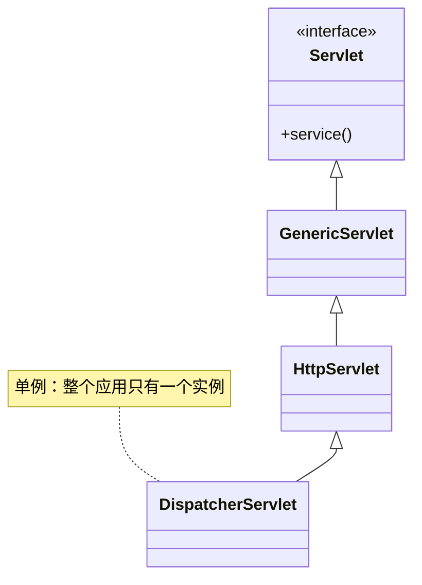
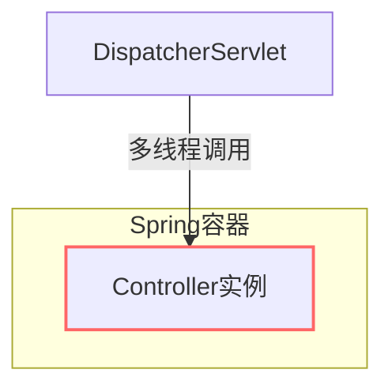
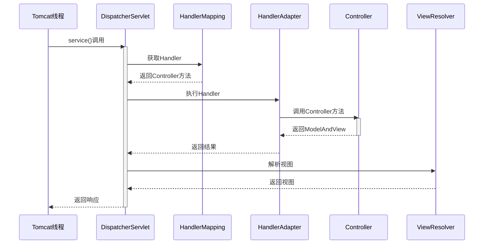

[[servlet-spring boot 1]]

您的问题触及了 Spring MVC 和 Servlet 容器运行机制的核心。我将从底层原理到实际表现全面解析这些关键概念：

### 一、Servlet 单例机制解析



#### Servlet 规范要求：
1. **每个 Servlet 类只有一个实例**（单例）
2. **多线程并发调用**：所有请求共享同一个实例
3. **线程安全性要求**：开发者必须确保线程安全

> 根据 Servlet 3.1 规范 2.3 节："The servlet container manages only one instance per servlet declaration"

### 二、DispatcherServlet 的单例性

#### 在 Spring Boot 应用中：
```java
// 自动配置核心代码
@Bean(name = DEFAULT_DISPATCHER_SERVLET_BEAN_NAME)
public DispatcherServlet dispatcherServlet() {
    return new DispatcherServlet(); // 单例Bean
}
```

**关键事实**：
1. ✅ 整个应用只有一个 `DispatcherServlet` 实例
2. ✅ 该实例由 Spring 容器管理（单例 Bean）
3. ✅ 所有 HTTP 请求都由这个实例处理

#### 验证方法：
```java
@RestController
public class DebugController {
    
    @Autowired
    private DispatcherServlet dispatcherServlet; // 注入同一个实例
    
    @GetMapping("/debug")
    public String debug() {
        return "DispatcherServlet实例: " + dispatcherServlet.hashCode();
    }
}
```
多次访问始终返回相同的 hashCode

### 三、Controller 的单例性



#### Controller 的本质：
1. **不是 Servlet**：Controller 是普通 Spring Bean
2. **默认作用域**：Singleton（单例）
3. **请求处理**：通过 DispatcherServlet 路由到 Controller 方法

#### 代码验证：
```java
@RestController
public class MyController {
    private int count = 0; // 实例变量
    
    @GetMapping("/count")
    public String showCount() {
        count++;
        return "当前计数: " + count + "，实例: " + this.hashCode();
    }
}
```
输出示例：
```
请求1：当前计数: 1，实例: 12345678
请求2：当前计数: 2，实例: 12345678  // 相同实例
请求3：当前计数: 3，实例: 12345678  // 计数值持续增加
```

### 四、线程安全问题深度分析

#### 危险代码示例：
```java
@RestController
public class UnsafeController {
    // 实例变量（状态）
    private List<String> cache = new ArrayList<>();
    
    @PostMapping("/add")
    public void addItem(@RequestParam String item) {
        cache.add(item); // 非线程安全！
    }
    
    @GetMapping("/items")
    public List<String> getItems() {
        return cache; // 可能读取到中间状态
    }
}
```

#### 安全解决方案：
| 方案 | 适用场景 | 示例 |
|------|----------|------|
| **无状态设计** | 推荐首选 | 所有数据通过方法参数传递 |
| **ThreadLocal** | 请求上下文 | SecurityContextHolder |
| **并发集合** | 共享缓存 | ConcurrentHashMap |
| **原型作用域** | 特殊需求 | `@Scope("prototype")` |

### 五、作用域配置详解

#### 修改 Controller 为多例：
```java
@RestController
@Scope(ConfigurableBeanFactory.SCOPE_PROTOTYPE) // 每次注入新实例
public class PrototypeController {
    private int id = (int)(Math.random() * 1000);
    
    @GetMapping("/id")
    public String getId() {
        return "实例ID: " + id + "，Hash: " + this.hashCode();
    }
}
```
输出示例：
```
请求1：实例ID: 42，Hash: 111111
请求2：实例ID: 87，Hash: 222222  // 不同实例
```

#### 性能影响对比：
| 作用域 | 内存占用 | 创建开销 | 适用场景 |
|--------|----------|----------|----------|
| 单例 | 低 | 一次性 | 绝大多数场景 |
| 原型 | 高 | 每次请求 | 需要隔离状态的场景 |

### 六、Spring MVC 请求处理全流程



### 七、实际应用建议

1. **Controller 设计原则**：
   ```java
   @RestController
   public class SafeController {
       // 正确：无状态，只依赖Service
       private final UserService userService; // 即使Service是单例也安全
       
       public SafeController(UserService userService) {
           this.userService = userService;
       }
       
       @GetMapping("/user/{id}")
       public User getUser(@PathVariable Long id) {
           // 线程安全：所有数据通过参数传入
           return userService.findById(id);
       }
   }
   ```

2. **需要避免的模式**：
   ```java
   @Controller
   public class ProblematicController {
       private User currentUser; // 危险：状态字段
       
       @PostMapping("/login")
       public void login(User user) {
           currentUser = user; // 多个请求会相互覆盖
       }
   }
   ```

### 八、总结

1. **DispatcherServlet**：
   - 严格单例（整个应用一个实例）
   - 由 Spring 容器管理
   - 多线程处理请求

2. **Tomcat 中的 Servlet**：
   - 每个 Servlet 类单例（规范要求）
   - 由 Servlet 容器管理

3. **Controller**：
   - 不是 Servlet，是普通 Spring Bean
   - 默认单例（可通过 `@Scope` 修改）
   - 必须设计为无状态或线程安全


pie
    title Spring MVC 组件单例性
    “DispatcherServlet” ： 1
    “Controller (默认)” ： 1
    “Service” ： 1
    “Repository” ： 1
    “其他Bean” ： 1


> **黄金法则**：在 Spring MVC 中，除了明确配置为原型作用域的 Bean，**所有组件默认都是单例**。理解这一原则对设计高性能、线程安全的 Web 应用至关重要。