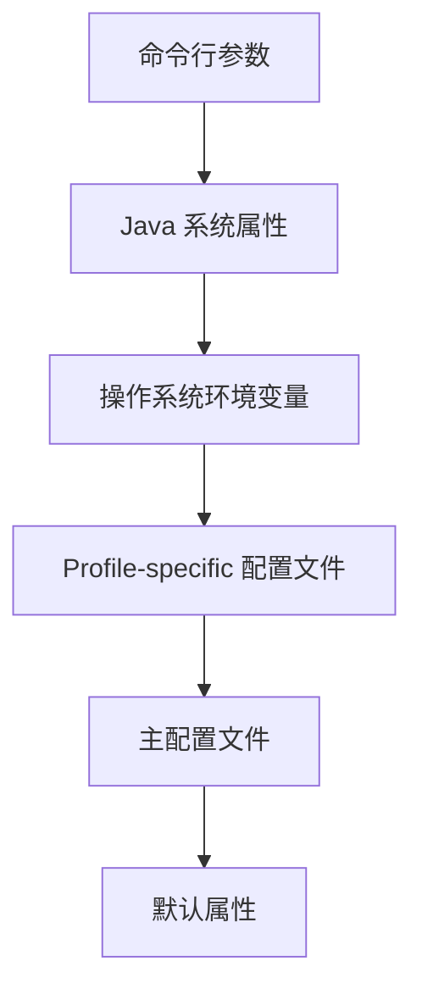
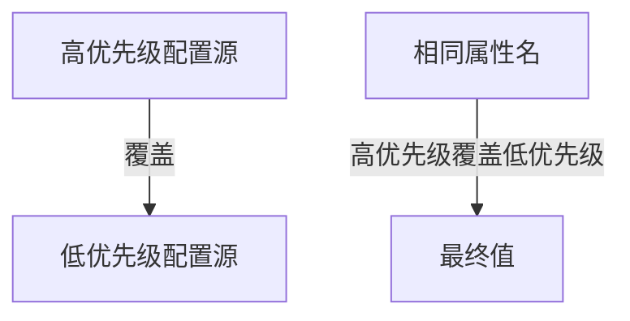
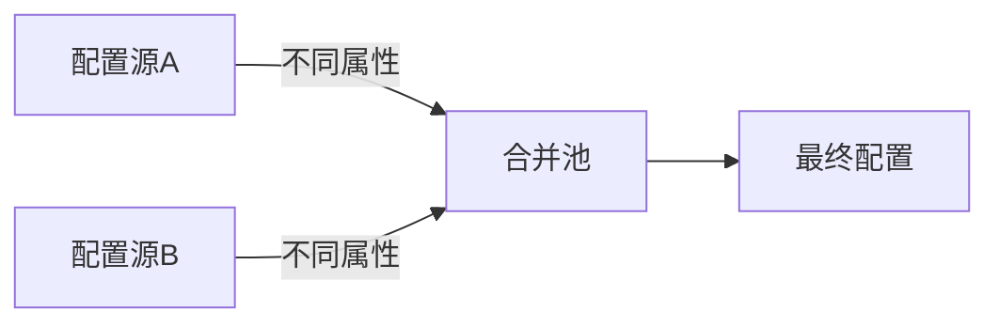
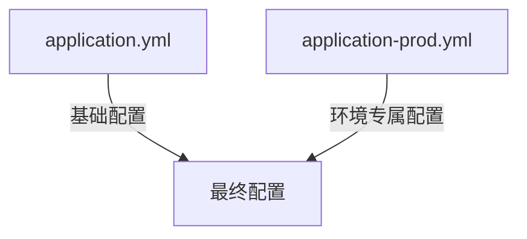
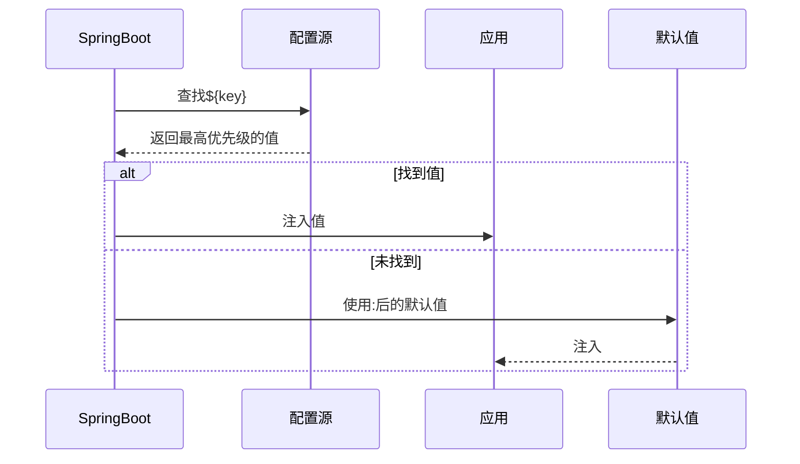

在 Spring Boot 应用中，配置的加载遵循一套**严格的优先级规则**，最终应用的配置是所有配置源合并后的结果。下面我将完整解析配置的加载机制，让您彻底明白程序最终使用的配置是如何确定的：

---

### 一、配置源加载优先级（从高到低）


#### 详细优先级顺序：
1. **命令行参数**：`java -jar app.jar --app.id=1001`
2. **Java 系统属性**：`-Dapp.id=1002`
3. **操作系统环境变量**：`export APP_ID=1003`
4. **Profile-specific 外部配置文件**：`config/application-prod.yml`
5. **Profile-specific 打包内配置文件**：`classpath:application-prod.yml`
6. **外部主配置文件**：`config/application.yml`
7. **打包内主配置文件**：`classpath:application.yml`
8. **@PropertySource 注解**：`@PropertySource("classpath:custom.properties")`
9. **默认属性**：`SpringApplication.setDefaultProperties()`

---

### 二、配置合并规则
#### 1. **覆盖原则**：


#### 2. **合并原则**：


#### 3. **示例场景**：
| 配置源                  | 内容                          | 最终生效值       |
|-------------------------|-------------------------------|------------------|
| application.yml         | `app.id: 100`                 | 被覆盖           |
| application-prod.yml    | `app.id: 200`                 | 被覆盖           |
| 环境变量 `APP_ID=300`   | 无文件                        | **300**（生效） |
| 命令行 `--app.id=400`   | 无文件                        | **400**（覆盖） |

---

### 三、Profile 机制深度解析
#### 1. **激活 Profile**：
```yaml
# application.yml
spring:
  profiles:
    active: prod  # 激活prod环境
```

#### 2. **配置文件加载顺序**：


#### 3. **多 Profile 支持**：
```bash
# 同时激活多个Profile
java -jar app.jar --spring.profiles.active=prod,metrics
```
加载顺序：
1. `application.yml`
2. `application-prod.yml`
3. `application-metrics.yml`

---

### 四、${} 占位符解析机制
#### 1. **解析顺序**：


#### 2. **嵌套解析示例**：
```yaml
# application.yml
db:
  host: ${DB_HOST:localhost}
  url: jdbc:mysql://${db.host}:${DB_PORT:3306}/${DB_NAME}
```

#### 3. **复杂来源示例**：
```java
// 通过代码获取解析值
@Value("${app.id:999}")
private int appId;

// 配置优先级：
// 1. 命令行 --app.id=1001
// 2. 系统属性 -Dapp.id=1002
// 3. 环境变量 APP_ID=1003
// 4. application-{profile}.yml
// 5. application.yml
```

---

### 五、查看最终配置的方法
#### 1. **Actuator 端点**：
```bash
# 查看所有生效配置
GET /actuator/env

# 返回结果：
{
  "activeProfiles": ["prod"],
  "propertySources": [
    {
      "name": "commandLineArgs",
      "properties": {"app.id": {"value": "400"}}
    },
    {
      "name": "systemProperties",
      "properties": {...}
    },
    {
      "name": "systemEnvironment",
      "properties": {"APP_ID": {"value": "300"}}
    },
    {
      "name": "applicationConfig: [classpath:/application-prod.yml]",
      "properties": {"app.id": {"value": "200"}}
    }
  ]
}
```

#### 2. **启动时打印**：
```bash
java -jar app.jar --debug

# 控制台输出：
DEBUG - Property 'app.id' value from command line: 400
INFO  - Overriding 'app.id' property: 200 -> 400
```

---

### 六、企业级配置最佳实践
#### 1. **安全分层策略**：
| 配置类型         | 存储位置                  | 示例                     |
|------------------|--------------------------|--------------------------|
| 敏感信息         | 环境变量/Vault           | 数据库密码               |
| 环境差异配置     | Profile-specific YAML    | 数据源URL                |
| 通用配置         | application.yml          | 日志级别                 |
| 开发者本地配置   | .env 文件（.gitignore）  | 本地调试端口             |

#### 2. **推荐目录结构**：
```
project/
├── config/
│   ├── application.yml       # 外部主配置（优先级高）
│   └── application-prod.yml  # 生产环境专属配置
├── src/
│   └── main/
│       ├── resources/
│       │   ├── application.yml       # 打包内基础配置
│       │   └── application-dev.yml   # 开发配置
│       └── java/
├── .env                       # 本地环境变量（不提交）
└── deploy-secrets             # 部署密钥（不提交）
```

#### 3. **启动命令规范**：
```bash
# 生产环境启动
java -jar app.jar \
  --spring.config.additional-location=file:/etc/app/config/ \
  --spring.profiles.active=prod \
  --spring.cloud.vault.token=${VAULT_TOKEN}
```

---

### 七、为什么需要这么复杂的机制？
1. **环境无缝切换**：同一份代码适应不同环境
2. **安全合规**：敏感信息与代码分离
3. **紧急修复**：运行时修改配置无需重新部署
4. **配置溯源**：明确知道每个配置值的来源

**黄金法则**：
> 在 Spring Boot 应用中，配置如同水流：
> - 高优先级配置是上游水源（命令行）
> - 低优先级配置是下游支流（默认文件）
> - 最终汇入应用的是所有水源的混合体
> - 上游污染物（错误配置）会污染整个水系

通过理解这套机制，您就能精准控制应用在各种环境下的行为了。