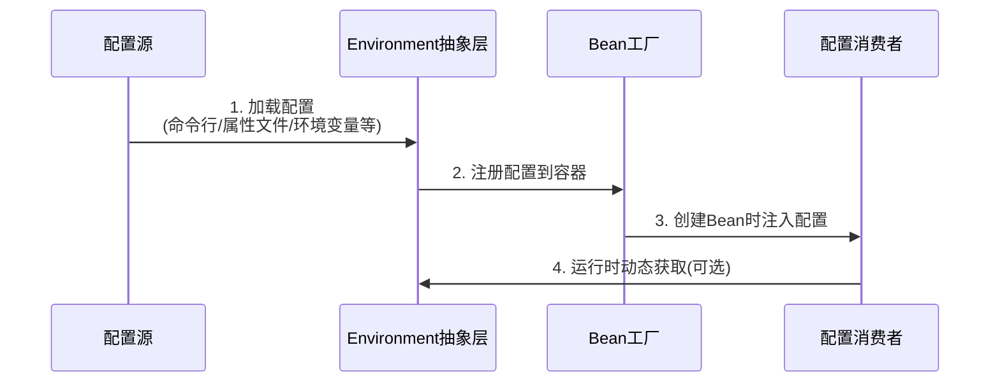
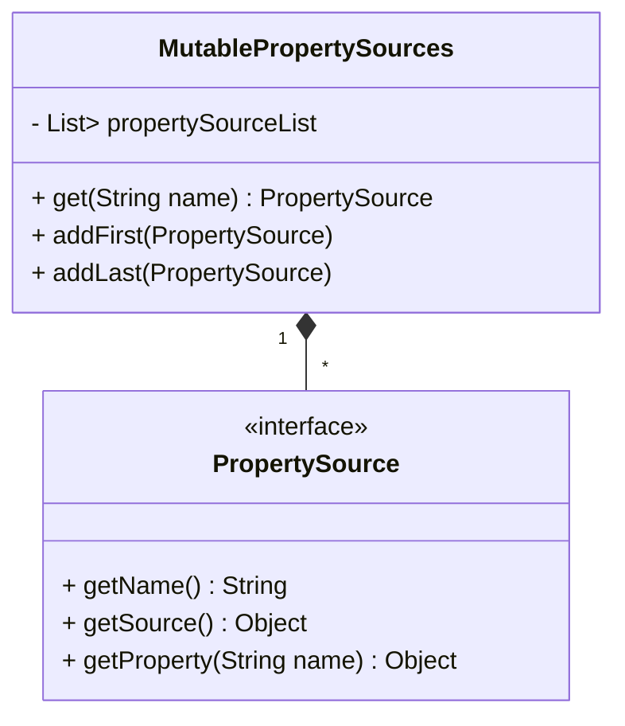
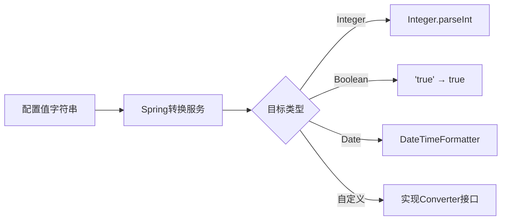
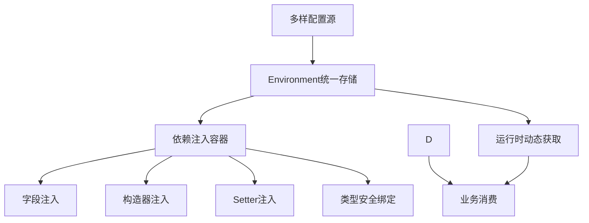

Spring Boot 的配置消费机制是一个精心设计的自动化流程，通过 **Environment 抽象层**和 **依赖注入容器**实现无缝集成。下面我将彻底解析配置从加载到使用的完整过程：

---

### 一、配置消费的核心流程


---

### 二、四步消费机制详解

#### 步骤1：配置加载与统一存储
**Environment 对象结构**：
```java
public interface Environment {
    // 获取单个属性
    String getProperty(String key);
    
    // 带默认值获取
    String getProperty(String key, String defaultValue);
    
    // 类型转换获取
    <T> T getProperty(String key, Class<T> targetType);
    
    // 配置源存储
    MutablePropertySources getPropertySources();
}
```

**PropertySources 内部结构**：


**加载顺序示例**：
```java
// 典型PropertySources顺序：
0: CommandLinePropertySource   // 命令行参数 (--key=value)
1: JndiPropertySource          // JNDI属性
2: SystemEnvironmentPropertySource // 系统环境变量
3: RandomValuePropertySource   // 随机值 (${random.int})
4: ConfigDataPropertySource    // 应用配置文件
5: DefaultProperties           // Spring Boot默认配置
```

---

#### 步骤2：配置注入到Bean
##### 方式1：字段注入（最常用）
```java
@Service
public class PaymentService {
    @Value("${payment.timeout:5000}") // 默认值5000ms
    private int timeout;
    
    @Value("${currency.code:USD}") 
    private String currency;
}
```
**注入过程**：
1. Bean创建时扫描`@Value`注解
2. 调用`environment.resolvePlaceholders(注解值)`
3. 类型转换器转换值（String→int等）
4. 反射设置字段值

##### 方式2：构造器注入（推荐）
```java
@Configuration
public class AppConfig {
    @Bean
    public DataSource dataSource(
        @Value("${db.url}") String url,
        @Value("${db.user}") String user
    ) {
        return new HikariDataSource(url, user);
    }
}
```

##### 方式3：Setter注入
```java
@Component
public class NotificationService {
    private boolean enabled;
    
    @Value("${notification.enabled:false}")
    public void setEnabled(boolean enabled) {
        this.enabled = enabled;
    }
}
```

---

#### 步骤3：类型安全绑定（高级）
```java
@ConfigurationProperties(prefix = "app.sms")
@Component
public class SmsProperties {
    private String apiKey;
    private int retryCount = 3; // 默认值
    private List<String> templates;
    
    // getters/setters 必须
}
```
**application.yml**：
```yaml
app:
  sms:
    api-key: "ABCD1234"
    retry-count: 5
    templates:
      - "welcome_template"
      - "payment_reminder"
```
**优势**：
- 自动嵌套对象绑定
- 支持集合类型
- 验证机制（JSR-303）
- IDEA自动补全（需添加依赖）

---

#### 步骤4：运行时动态获取
```java
@Component
public class DynamicConfigConsumer {
    @Autowired
    private Environment env;
    
    public void process() {
        // 动态获取最新配置（支持热更新）
        int threshold = env.getProperty("risk.threshold", Integer.class, 100);
        
        if (System.currentTimeMillis() > peakTime) {
            // 运行时计算新值
            threshold = env.getProperty("risk.peak-threshold", Integer.class, 150);
        }
    }
}
```

---

### 三、配置转换与处理机制

#### 1. 类型自动转换


#### 2. 占位符解析
```java
@Value("${api.endpoint:https://default.com}/v1/${api.version}/resource")
private String apiUrl;
```
解析过程：
1. 先解析`${api.endpoint:https://default.com}`
2. 再解析`${api.version}`
3. 拼接结果：`https://custom.com/v1/2.0/resource`

#### 3. 复杂对象绑定
```yaml
app:
  security:
    cors:
      allowed-origins:
        - "https://domain1.com"
        - "https://domain2.com"
      max-age: 3600
```
绑定到：
```java
@ConfigurationProperties("app.security.cors")
public class CorsProperties {
    private List<String> allowedOrigins;
    private long maxAge;
}
```

---

### 四、企业级配置消费最佳实践

#### 1. 分层配置策略
| 配置类型 | 消费方式          | 示例                     |
|----------|------------------|--------------------------|
| 敏感信息 | 直接@Value注入   | `@Value("${db.password}")` |
| 业务参数 | @ConfigurationProperties | 支付超时时间           |
| 功能开关 | Environment动态获取 | 灰度发布开关           |
| 常量配置 | 枚举类绑定        | 错误代码映射            |

#### 2. 配置验证
```java
@Validated
@ConfigurationProperties("app.email")
public class EmailProperties {
    @NotNull
    private String host;
    
    @Min(1)
    @Max(65535)
    private int port;
    
    @Pattern(regexp = ".+@.+\\..+")
    private String sender;
}
```
启动时自动校验，配置错误立即报错！

#### 3. 配置元数据
**META-INF/spring-configuration-metadata.json**：
```json
{
  "properties": [{
    "name": "app.sms.api-key",
    "type": "java.lang.String",
    "description": "短信平台API密钥",
    "sourceType": "com.example.SmsProperties"
  }]
}
```
实现IDE自动提示：


---

### 五、配置消费全流程示例
**启动命令**：
```bash
java -Dapp.env=prod -jar app.jar --payment.timeout=3000
```

**application-prod.yml**：
```yaml
payment:
  currency: EUR
  max-amount: 10000
```

**业务代码**：
```java
@Service
@ConfigurationProperties("payment")
public class PaymentService {
    // 命令行参数覆盖配置: --payment.timeout=3000
    private int timeout = 5000; 
    
    // 配置文件配置: currency: EUR
    private String currency; 
    
    // 未配置，使用默认值
    private boolean international = true; 
    
    public void process() {
        // 动态获取环境变量
        String region = env.getProperty("app.region", "US");
    }
}
```

**运行时效果**：
| 配置项          | 值      | 来源              |
|-----------------|--------|-------------------|
| timeout         | 3000   | 命令行参数        |
| currency        | EUR    | application-prod.yml |
| international   | true   | 代码默认值        |
| region          | "US"   | 环境变量(默认)    |

---

### 六、高级特性：配置动态更新

#### 1. @RefreshScope（配合Spring Cloud Config）
```java
@RefreshScope
@Service
public class DynamicService {
    @Value("${dynamic.config}")
    private String config; // 修改配置后自动刷新
}
```

#### 2. 监听配置变更
```java
@Component
public class ConfigChangeListener {
    @EventListener
    public void handle(EnvironmentChangeEvent event) {
        event.getKeys().forEach(key -> {
            log.info("Config changed: {} = {}", key, env.getProperty(key));
        });
    }
}
```

---

### 关键总结
Spring Boot 的配置消费本质是：


**消费哲学**：  
1. **声明式消费**：通过注解声明需求（"我需要这个配置"）  
2. **被动注入**：容器自动满足需求（"给你需要的东西"）  
3. **关注点分离**：业务代码不关心配置来源  
4. **动态适应**：环境变化无需修改代码  

这种机制使开发者只需关注业务逻辑，将配置管理完全交给框架，是 Spring Boot "约定优于配置" 理念的完美体现。