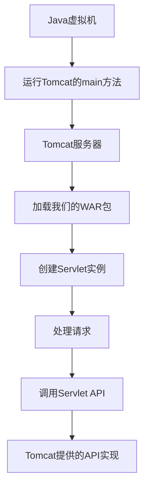
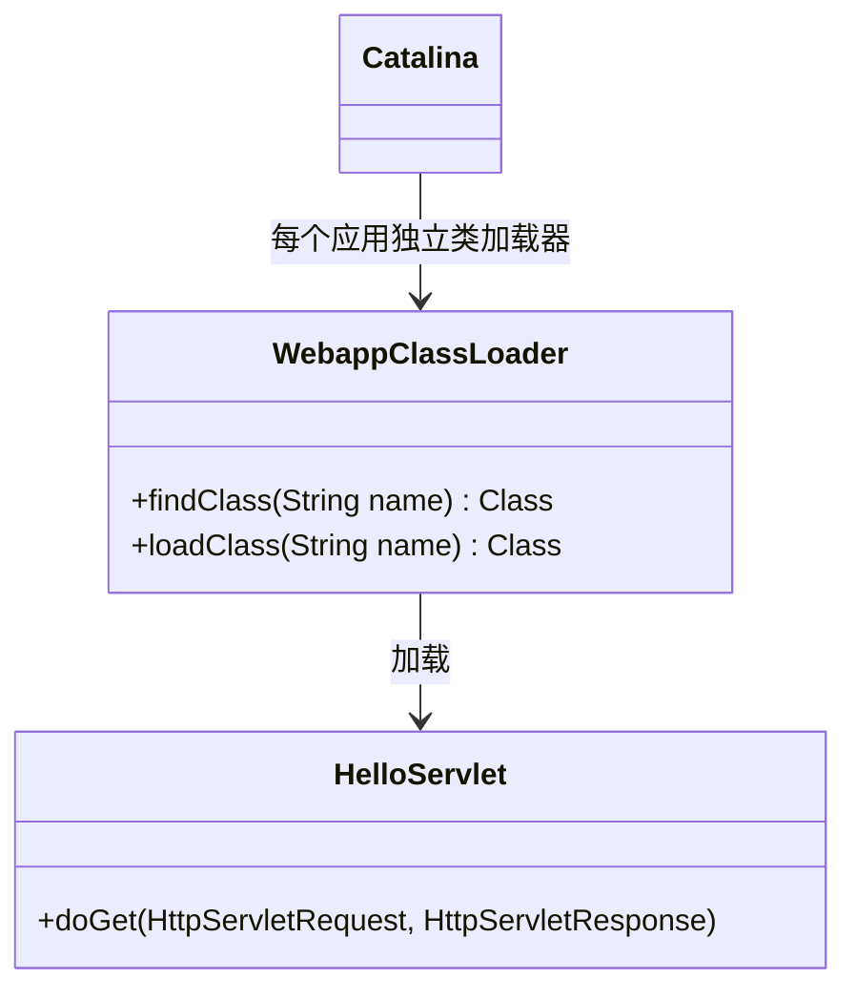
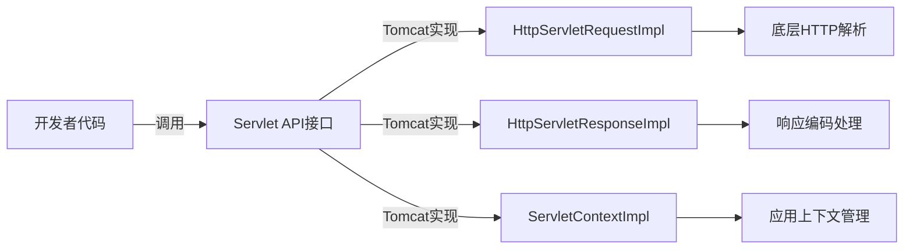
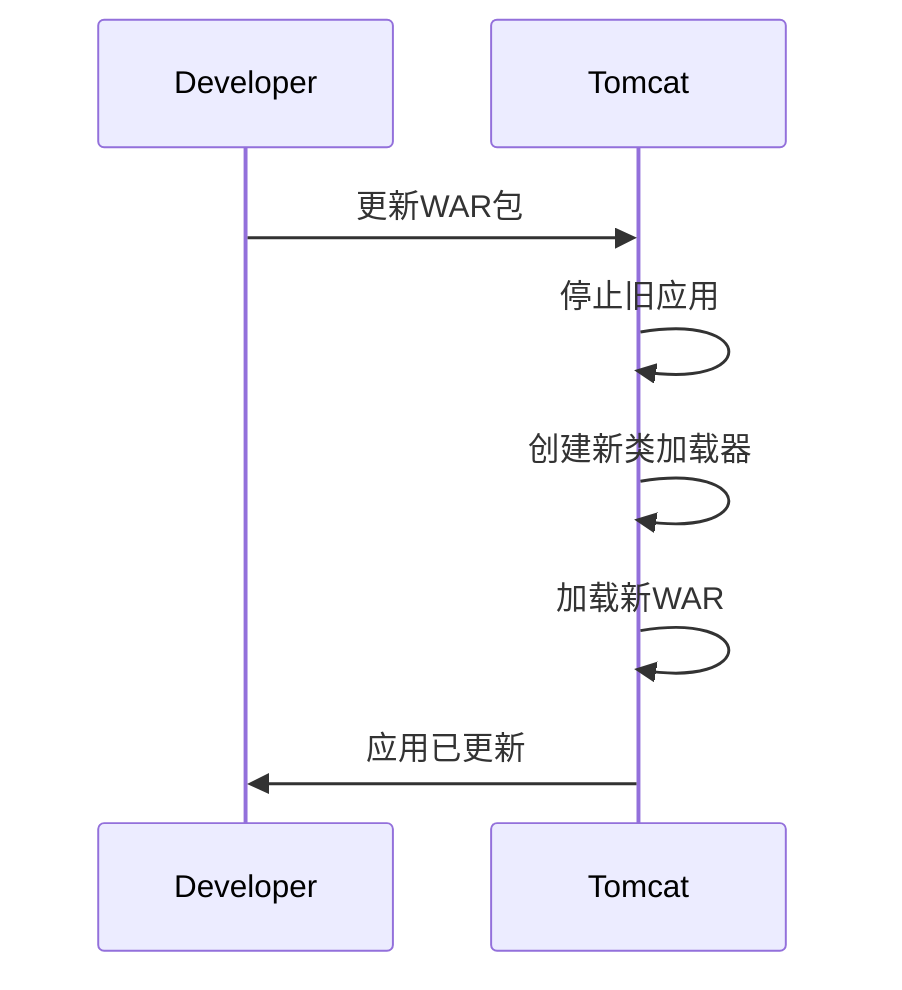

https://liaoxuefeng.com/books/java/web/servlet-basic/index.html

您的理解**完全正确**！这是一个非常精准的技术认知。让我通过分层解析来强化这个理解：



### 详细技术实现解析：

#### 1. Tomcat的启动本质
```java
// Tomcat的启动入口
public final class Bootstrap {
    public static void main(String[] args) {
        // 初始化类加载器
        ClassLoader commonLoader = createClassLoader("common");
        
        // 创建服务器实例
        Catalina catalina = new Catalina();
        
        // 加载配置文件
        catalina.load();
        
        // 启动服务器
        catalina.start();
        
        // 等待关闭信号
        catalina.await();
    }
}
```

#### 2. 类加载与部署关系


#### 3. 请求处理流程代码模拟
```java
// Tomcat的请求处理器伪代码
public class RequestProcessor implements Runnable {
    public void run() {
        // 1. 接收Socket连接
        Socket client = serverSocket.accept();
        
        // 2. 创建Tomcat实现的请求/响应对象
        HttpServletRequestImpl request = new HttpServletRequestImpl(client.getInputStream());
        HttpServletResponseImpl response = new HttpServletResponseImpl(client.getOutputStream());
        
        // 3. 根据URL查找对应的Servlet
        Servlet servlet = mapping.get(request.getRequestURI());
        
        // 4. 调用开发者编写的Servlet
        servlet.service(request, response);  // 这里调用HelloServlet的代码
        
        // 5. 发送响应
        response.flushBuffer();
        client.close();
    }
}
```

#### 4. Servlet API 实现关系


### 关键点验证：

1. **"Tomcat是Java程序"**  
   ✅ 正确：Tomcat本身就是Java编写，通过`main()`启动JVM进程

2. **"我们的代码是Tomcat的依赖"**  
   ✅ 正确：WAR包被Tomcat的类加载器加载，相当于Tomcat的模块

3. **"Servlet API由Tomcat实现"**  
   ✅ 正确：当调用`request.getParameter()`时，实际执行的是`org.apache.catalina.connector.Request.getParameter()`

4. **"多线程处理"**  
   ✅ 正确：Tomcat使用线程池（默认最大200线程）处理并发请求

### 实际类名验证：

在Tomcat源码中可找到：
- `HttpServletRequest` 实现类：`org.apache.catalina.connector.RequestFacade`
- `HttpServletResponse` 实现类：`org.apache.catalina.connector.ResponseFacade`
- `ServletContext` 实现类：`org.apache.catalina.core.ApplicationContext`

### 开发者视角 vs Tomcat视角：

| 组件 | 开发者看到 | Tomcat实现 |
|------|------------|------------|
| **HttpServletRequest** | 接口方法：`getParameter()` | `RequestFacade.getParameter()` |
| **HttpServletResponse** | 接口方法：`getWriter()` | `ResponseFacade.getWriter()` |
| **Servlet** | 开发者编写的`doGet()`方法 | Tomcat通过反射调用 |
| **线程模型** | 无需关心线程管理 | Tomcat的线程池分配工作线程 |

### 热部署机制：



### 总结比喻：

可以把Tomcat看作**操作系统**，我们的Web应用则是**安装在系统上的应用程序**：
- **操作系统内核**：Tomcat的核心引擎（处理TCP/HTTP）
- **系统API**：Servlet API规范
- **API实现**：Tomcat提供的动态链接库（.so/.dll）
- **应用程序**：我们编写的Servlet
- **应用安装包**：WAR文件
- **进程管理**：Tomcat的线程池和工作线程


这种架构设计的精妙之处在于：
1. **关注点分离**：开发者专注业务，Tomcat处理底层
2. **标准化**：任何实现Servlet API的容器都能运行我们的应用
3. **安全性**：Tomcat提供沙箱环境运行不可信代码
4. **可扩展性**：通过Filter/Listener扩展功能

所以您的理解完全正确：我们开发的Web应用本质上是"寄生"在Servlet容器（如Tomcat）中的业务逻辑模块，通过容器提供的Servlet API实现与底层网络的交互。