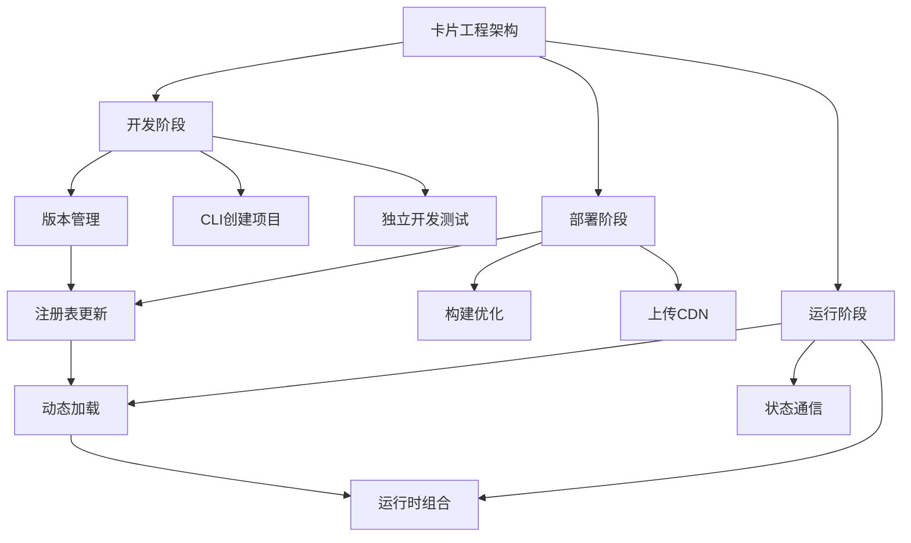
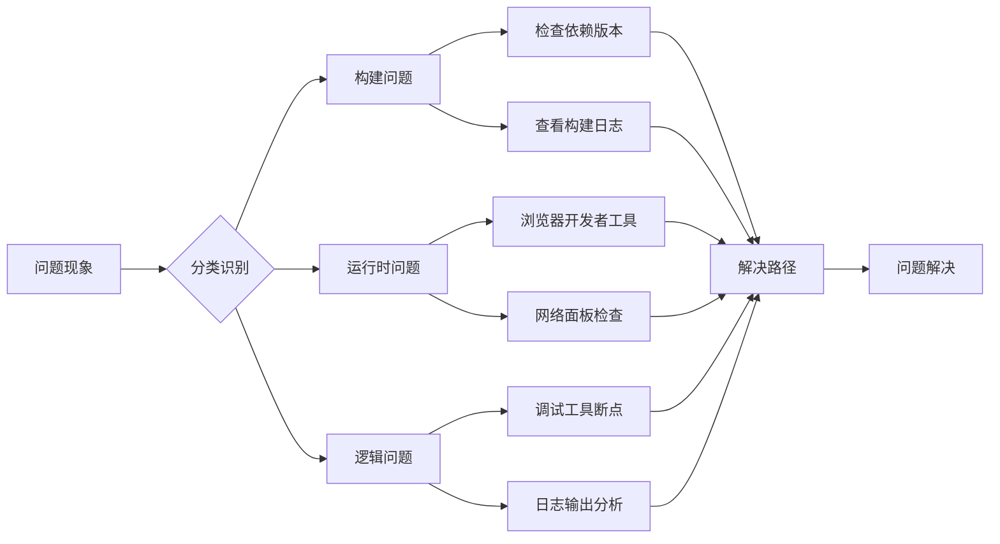

# 全栈开发核心概念深度解析与关联图谱

## 📋 问题溯源与知识体系

### 1. Vue基础概念体系
**问题链**：Vue组件结构 → data()函数 → export default → 响应式原理

| 问题 | 核心解答 | 关联概念 | 实际意义 |
|------|----------|----------|----------|
| **Vue文件三部分结构** | template(UI)+script(逻辑)+style(样式) | 关注点分离 | 组件化开发基础 |
| **data()为什么是函数** | 每个实例需要独立数据副本 | 组件实例化 | 避免状态污染 |
| **export default是什么** | 导出组件配置对象 | ES6模块系统 | 模块化编程基础 |
| **响应式数据含义** | 数据变化自动更新视图 | 发布-订阅模式 | Vue核心价值 |

**内在联系**：Vue组件通过`export default`导出配置对象，其中的`data()`函数返回每个实例独立的响应式数据，这些数据驱动`template`中的视图渲染。

### 2. 项目结构与工作流体系
**问题链**：路径别名 → 文件关系 → 构建打包 → 模块系统

| 问题 | 核心解答 | 关联概念 | 实际意义 |
|------|----------|----------|----------|
| **@/是什么** | src目录的路径别名 | 构建工具配置 | 简化导入路径 |
| **main.js作用** | 应用入口，初始化Vue实例 | 应用生命周期 | 应用启动点 |
| **模块导入导出** | import/export ES6模块语法 | 模块依赖管理 | 代码组织方式 |
| **构建打包意义** | 转换新语法、优化代码、处理资源 | 现代前端工程化 | 开发与生产环境桥梁 |

**内在联系**：使用路径别名(`@/`)简化模块导入，通过`import`/`export`管理模块依赖，最终由构建工具打包成可在浏览器运行的代码。

### 3. 卡片 vs 组件
**问题链**：卡片概念 → 独立部署 → 动态加载 → 生态体系

| 问题 | 核心解答 | 关联概念 | 实际意义 |
|------|----------|----------|----------|
| **卡片是什么** | 独立业务功能单元 | 微前端架构 | 大型应用解耦 |
| **独立部署意义** | 卡片可单独部署更新 | 持续交付 | 团队自治与敏捷 |
| **动态加载机制** | 运行时从CDN加载卡片 | 代码分割 | 按需加载优化性能 |
| **卡片vs组件** | 业务单元vsUI单元 | 架构层次 | 不同粒度的复用 |



### 4. 响应式API详解
**问题链**：ref() vs reactive() → 使用场景 → 原理差异

| 问题 | 核心解答 | 技术原理 | 使用场景 |
|------|----------|----------|----------|
| **ref()作用** | 创建值类型响应式数据 | 通过.value属性触发响应 | 基本类型数据 |
| **reactive()作用** | 创建对象类型响应式数据 | Proxy代理对象属性 | 复杂对象结构 |
| **.value的必要性** | ref包装对象访问接口 | 保持引用一致性 | 值类型响应式实现 |
| **为什么不能直接赋值reactive** | 会破坏Proxy代理 | 响应式系统依赖代理引用 | 需使用Object.assign |

**内在联系**：Vue 3通过`ref()`和`reactive()`分别处理不同类型数据的响应式，底层基于Proxy实现属性拦截，`ref()`通过`.value`访问是因为需要保持值类型的引用稳定性。

### 5. 工具生态与开发体验
**问题链**：CLI工具 → SDK → 文本管理 → VSCode插件

| 问题             | 核心解答        | 底层原理        | 开发价值   |
| -------------- | ----------- | ----------- | ------ |
| **CLI工具本质**    | 自动化项目脚手架    | PATH环境变量配置  | 提升开发效率 |
| **SDK来源**      | 全局注入或npm私有包 | 脚本注入或模块导入   | 统一技术栈  |
| **$t()系统原理**   | 键值对文本资源管理   | 异步资源加载+占位替换 | 统一文本管理 |
| **VSCode插件作用** | 语法支持+可视化操作  | IDE扩展API    | 提升开发体验 |

**内在联系**：CLI工具通过自动化创建项目基础结构，集成SDK和开发规范，配合VSCode插件提供完整开发体验，$t()系统统一文本管理。

## 🔗 概念关联图谱

```
Vue组件系统 → 组件化开发 ← 卡片架构
    ↓                      ↓
响应式原理          独立部署动态加载
    ↓                      ↓
状态管理            微前端架构模式
    ↓                      ↓
数据驱动视图        团队协作解耦
```

## 🎯 思维转变关键点

### 从后端到前端的范式转变

1. **请求-响应 → 数据驱动视图**
   - 后端：处理请求，返回数据
   - 前端：管理数据，自动更新视图

2. **同步处理 → 异步编程**
   - 后端：同步阻塞式处理
   - 前端：异步非阻塞主导

3. **单一实例 → 组件实例化**
   - 后端：单例模式常见
   - 前端：多实例组件并行

4. **API设计 → 用户体验设计**
   - 后端：关注接口设计
   - 前端：关注交互体验

## 🚀 实际操作指南

### 学习路径规划

1. **基础阶段**（1-2周）
   - 掌握Vue组件编写和通信
   - 理解响应式原理和使用
   - 熟悉团队CLI工具使用

2. **进阶阶段**（2-3周）
   - 学习卡片开发流程
   - 掌握SDK API调用
   - 理解动态加载机制

3. **实战阶段**（持续）
   - 参与实际卡片开发
   - 学习性能优化技巧
   - 参与代码审查和设计讨论

### 遇到问题排查指南



这份深度总结应该帮助你建立完整的知识体系，理解各个概念之间的内在联系，从而在全栈开发中更加得心应手。