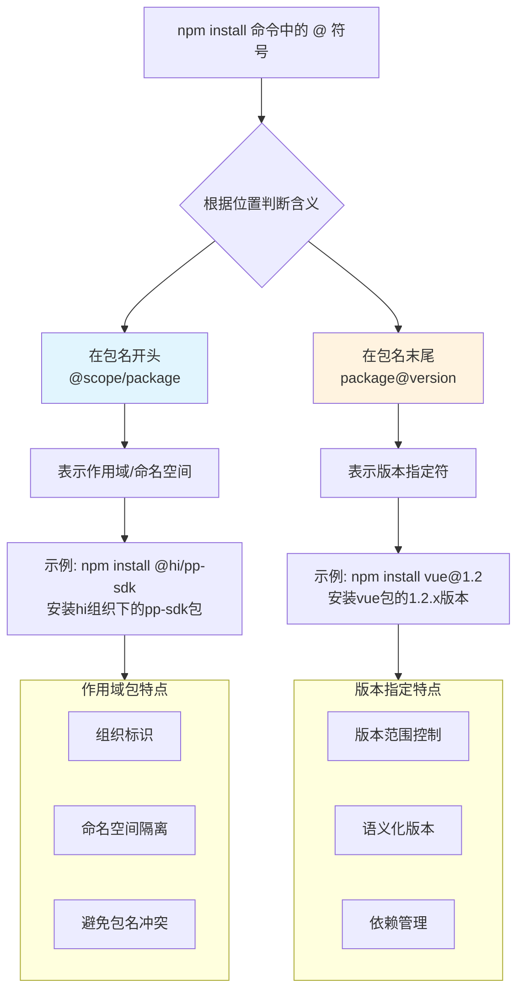

# 🔍 详解 npm 安装命令中的 @ 符号：作用域 vs 版本


## 📌 快速答案

**`vue@1.2` 中的 `@` 表示版本指定符**，意思是"安装 vue 包的 1.2.x 版本"。

这与 `@hi/pp-sdk` 中的 `@` 含义完全不同，后者表示**作用域/命名空间**。

## 🔄 @ 符号的两种不同用途对比

为了更清晰地理解这种区别，我为你准备了一个对比图：



## 🏷️ 版本指定符的详细用法

### 基本语法
```bash
npm install <package-name>@<version-specifier>
```

### 具体示例和含义
| 命令 | 含义 | 说明 |
|------|------|------|
| `npm install vue@1.2` | 安装 1.2.x 系列的最新版本 | 相当于 `vue@^1.2.0` |
| `npm install vue@1.2.8` | 安装确切的 1.2.8 版本 | 固定版本，不会自动更新 |
| `npm install vue@latest` | 安装最新版本 | |
| `npm install vue@next` | 安装预发布版本 | 如 alpha, beta, rc 版本 |

## 📊 版本指定符的语义化版本控制

npm 使用语义化版本（SemVer）规范，你可以精确控制安装的版本范围：

```bash
# 精确版本
npm install vue@2.6.14          # 只安装 2.6.14

# 兼容性版本（允许小版本和补丁版本更新）
npm install vue@^2.6.14         # 2.6.14 ≤ 版本 < 3.0.0
npm install vue@~2.6.14         # 2.6.14 ≤ 版本 < 2.7.0

# 版本范围
npm install vue@">=2.5.0 <3.0.0" # 2.5.0 到 3.0.0 之间

# 预发布版本
npm install vue@3.0.0-alpha.1   # 安装特定的预发布版本
```

## 🎯 实际工作中的应用场景

### 场景一：安装特定版本解决兼容性问题
```bash
# 当前项目需要 Vue 2.x
npm install vue@^2.6.0

# 新项目可以使用 Vue 3.x
npm install vue@^3.2.0
```

### 场景二：降级或升级包版本
```bash
# 发现新版本有bug，降级到稳定版本
npm uninstall vue
npm install vue@2.6.14

# 升级到最新版本
npm install vue@latest
```

### 场景三：安装预发布版本进行测试
```bash
# 测试即将发布的新版本
npm install vue@next

# 测试特定的RC版本
npm install vue@3.2.0-rc.1
```

## 🔍 如何查看可用版本

如果你不确定有哪些版本可用，可以先查看：

```bash
# 查看包的所有版本
npm view vue versions

# 查看包的详细信息（包括最新版本）
npm view vue

# 查看特定版本的详细信息
npm view vue@2.6.14
```

## 💡 版本管理最佳实践

### 1. 在 package.json 中合理使用版本范围
```json
{
  "dependencies": {
    "vue": "^2.6.14",     // 允许自动更新小版本和补丁版本
    "react": "~17.0.2",   // 只允许更新补丁版本
    "lodash": "4.17.21"   // 固定版本，永不自动更新
  }
}
```

### 2. 使用 package-lock.json 锁定版本
为了保证团队协作和部署的一致性，应该提交 `package-lock.json` 文件，它会锁定所有依赖的确切版本。

### 3. 定期更新依赖
```bash
# 检查过时的包
npm outdated

# 更新所有包到最新版本（在package.json允许的范围内）
npm update

# 交互式更新（推荐）
npx npm-check -u
```

## 🎯 总结

- **`@hi/pp-sdk`** 中的 `@`：表示**作用域/命名空间**
- **`vue@1.2`** 中的 `@`：表示**版本指定符**
- **位置决定含义**：`@` 在包名开头是作用域，在包名末尾是版本
- **版本控制很重要**：合理使用版本范围可以平衡稳定性和新特性

