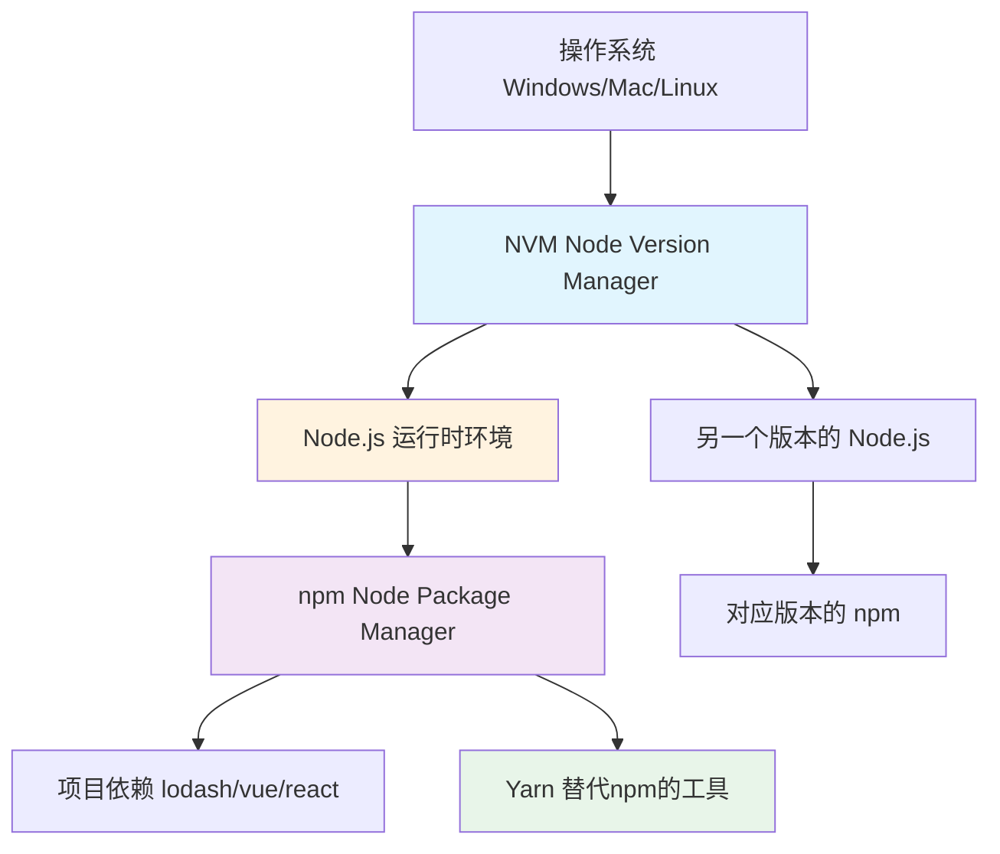

# 🚀 前端包管理终极指南


## 📦 核心概念关系图

首先，我们通过一张图来理解这些工具之间的关系和层次：



## 1. Node.js、npm、nvm、Yarn 到底是什么？

### 🔹 Node.js - JavaScript 运行时环境
**是什么**：让JavaScript能够脱离浏览器在服务器端运行的环境。  
**为什么需要**：前端开发工具（如Webpack、Vite）和构建过程都需要Node.js环境。

### 🔹 npm - Node包管理器（Node Package Manager）
**是什么**：随Node.js一起安装的默认包管理工具，用于安装、分享JavaScript包。  
**作用**：管理项目依赖（如Vue、React、Lodash等第三方库）。

### 🔹 nvm - Node版本管理器（Node Version Manager）
**是什么**：用于在同一台机器上安装和切换不同版本Node.js的工具。  
**为什么需要**：不同项目可能需要不同版本的Node.js，nvm让你轻松切换。

### 🔹 Yarn - 另一个包管理器
**是什么**：Facebook开发的替代npm的包管理器，更快、更可靠。  
**现在地位**：现在npm已经改进很多，两者功能相似，选择其一即可。

## 2. 安装与环境配置

### 安装顺序建议
1. **先安装 nvm**（管理Node.js版本）
2. **用 nvm 安装 Node.js**（自动包含npm）
3. **可选择安装 Yarn**（可选，通过npm安装）

### 具体安装步骤

#### Windows系统：
1. 下载nvm-windows：https://github.com/coreybutler/nvm-windows/releases
2. 运行安装程序，它会自动设置环境变量
3. 打开命令行，使用nvm安装Node.js：

```bash
nvm install 18.16.0  # 安装指定版本
nvm use 18.16.0       # 使用该版本
```

#### Mac/Linux系统：
```bash
# 安装nvm
curl -o- https://raw.githubusercontent.com/nvm-sh/nvm/v0.39.0/install.sh | bash

# 重启终端后安装Node.js
nvm install 18
nvm use 18
```

### 环境变量是什么？
**简单理解**：告诉系统在哪里查找可执行程序。nvm会自动设置好环境变量，这就是为什么安装nvm后，你可以在任何位置使用node、npm命令。

## 3. nvm切换版本时发生了什么？

当你使用`nvm use 18.16.0`时：

1. nvm会修改环境变量，指向指定版本的Node.js
2. 该版本自带的npm也会被激活
3. 每个Node.js版本都有自己**独立**的全局模块

**重要提示**：不同Node.js版本下的全局模块是隔离的！安装在不同版本的全局包不会共享。

## 4. 依赖安装与管理

### 项目依赖安装（npm install）
当你运行`npm install`或`npm i`时：

1. **读取**`package.json`中的依赖列表
2. **下载**依赖包到`node_modules`文件夹（项目根目录下）
3. **生成**`package-lock.json`确保每次安装的版本一致

```bash
# 安装项目所有依赖（根据package.json）
npm install

# 安装单个包并保存到dependencies
npm install package-name --save
# 或简写
npm i package-name -S

# 安装开发依赖（如webpack、eslint等）
npm install package-name --save-dev
# 或简写
npm i package-name -D

# 全局安装（工具类，如vue-cli、create-react-app）
npm install -g package-name
```

## 5. 全局模块与缓存

### 🔹 全局模块（global packages）
**位置**：默认在`C:\Users\用户名\AppData\Roaming\npm`（Windows）或`/usr/local/lib`（Mac/Linux）  
**用途**：安装全局可用的命令行工具，如`vue-cli`、`create-react-app`等

### 🔹 全局缓存（cache）
**位置**：默认在`~/.npm`目录  
**用途**：存储已下载的包，避免重复下载

### 🔹 修改全局模块和缓存位置
有时为了节省C盘空间或统一管理，需要修改默认位置：

```bash
# 设置全局模块安装位置
npm config set prefix "D:\nodejs\node_global"

# 设置缓存位置
npm config set cache "D:\nodejs\node_cache"

# 查看当前配置
npm config list
```

**完成后必须将新路径添加到系统环境变量PATH中**，否则系统找不到全局命令。

## 6. npm config 配置详解

npm的配置控制着其行为，常用配置项：

### 🔸 registry - 包镜像源
**是什么**：指定从哪个服务器下载包  
**为什么重要**：国内访问默认源慢，需要切换国内镜像

```bash
# 查看当前源
npm config get registry

# 设置为淘宝镜像（国内推荐）
npm config set registry https://registry.npmmirror.com/

# 恢复官方源
npm config set registry https://registry.npmjs.org/
```

### 🔸 prefix - 全局安装路径
**是什么**：指定全局模块的安装位置

### 🔸 cache - 缓存路径
**是什么**：指定包缓存的位置

### 🔸 proxy - 代理设置
**公司网络可能需要**：如果公司有网络代理，需要设置此项

```bash
# 设置代理
npm config set proxy http://proxy.company.com:8080
npm config set https-proxy http://proxy.company.com:8080

# 有认证的代理
npm config set proxy http://用户名:密码@proxy.company.com:8080
```

## 7. 日常开发常用命令速查

| 命令 | 作用 | 示例 |
|------|------|------|
| `nvm list` | 查看已安装的Node版本 | `nvm list` |
| `nvm use <version>` | 切换Node版本 | `nvm use 18.16.0` |
| `npm init` | 初始化新项目 | `npm init -y`（快速初始化） |
| `npm install` | 安装项目依赖 | `npm i` |
| `npm run <script>` | 运行package.json中的脚本 | `npm run dev` |
| `npm update` | 更新依赖包 | `npm update` |
| `npm list` | 查看已安装的包 | `npm list -g --depth=0`（查看全局包） |

## 8. 公司项目实操指南

明天你到公司可以这样操作：

1. **查看项目要求**
   ```bash
   # 查看项目是否有.nvmrc文件（指定Node版本）
   cat .nvmrc
   
   # 查看package.json中的engines字段
   # 这会告诉你项目需要的Node版本
   ```

2. **使用正确版本的Node.js**
   ```bash
   # 如果项目指定了版本，安装并使用该版本
   nvm install 16.14.0
   nvm use 16.14.0
   ```

3. **安装项目依赖**
   ```bash
   # 首先设置国内镜像（如果公司没特殊要求）
   npm config set registry https://registry.npmmirror.com/
   
   # 安装依赖
   npm install
   
   # 如果安装慢或失败，可以尝试
   npm install --registry=https://registry.npmmirror.com/
   ```

4. **运行项目**
   ```bash
   # 查看package.json中的scripts字段
   # 看看有哪些可用的命令
   npm run dev    # 通常是开发环境
   npm run serve  # 或者这个
   npm start      # 或者是这个
   ```

## 🎯 总结重点

1. **nvm管Node版本**，让你轻松切换不同项目所需的不同Node版本

2. **npm管项目依赖**，负责安装和管理第三方库
3. **全局模块**是工具，**项目依赖**是项目需要的库
4. **配置registry**可以极大提高下载速度
5. 每个项目都应该用`nvm use`切换到正确的Node版本后再`npm install`

