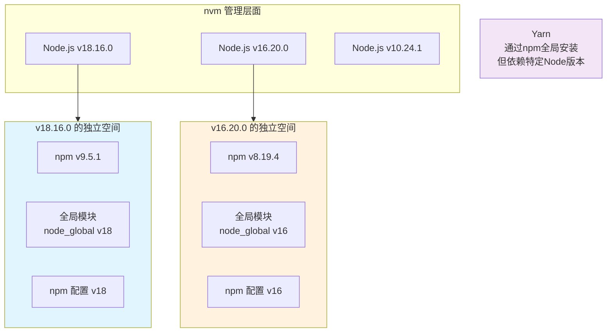

# 🧠 深入理解 Node.js 生态：版本管理、依赖与配置


## 1. Node.js 的本质：与 Python 解释器的类比

**你的理解完全正确！**

|  | Python | Node.js |
| :--- | :--- | :--- |
| **是什么** | 编程语言 + 解释器 | JavaScript 运行时环境 |
| **核心引擎** | CPython, PyPy 等 | V8 (Google 的 JavaScript 引擎) |
| **运行方式** | `python script.py` | `node script.js` |
| **包管理器** | pip, conda | npm, yarn, pnpm |
| **版本管理** | pyenv, conda env | nvm |

**关键区别**：Python 是一门语言，Node.js 是一个让 JavaScript 能在浏览器外运行的环境。浏览器和 Node.js 都使用 JavaScript，但提供了不同的 API（例如，浏览器有 `document`，Node.js 有 `fs` 文件系统模块）。

```bash
# 运行 Python 脚本
python hello.py

# 运行 JavaScript (Node.js) 脚本
node hello.js
```

---

## 2. nvm、Node.js、npm、Yarn 的关系与隔离性

这是你困惑的核心，我用一个清晰的图示来解释它们的管理范围：



### 解答你的具体问题：

-   **切换 Node 版本，Yarn 会怎样？**
    Yarn 是**通过 npm 全局安装**的（`npm install -g yarn`），所以它**“寄生”于某个具体的 Node 版本**。你用 nvm 切换 Node 版本后，之前版本安装的全局 Yarn 在新版本下**不可用**，需要在新版本下重新安装。

-   **npm 配置项对所有版本生效吗？**
    **不是！** 这是最关键的一点。**每个 Node 版本都有自己独立的 npm 和独立的配置（.npmrc）**。你用 nvm 安装一个新版本的 Node.js 后，它的 npm 配置是默认的，你需要重新设置 `registry`、`prefix` 等。

-   **全局模块是隔离的吗？**
    **是的，完全隔离！** 这也是 nvm 的核心价值。项目 A 用 Node 18，全局安装了 `vue-cli`。项目 B 用 Node 16，如果它也想用 `vue-cli`，必须在 Node 16 环境下重新全局安装一次。这样避免了版本冲突。

-   **全局依赖是多个项目共享一份吗？**
    **是，也不是。**
    -   在**同一个 Node 版本下**，全局安装的工具（如 `yarn`, `vue-cli`, `create-react-app`）可以被该版本下的所有项目共享使用。
    -   在**不同的 Node 版本下**，全局模块是隔离的，不共享。

---

## 3. 浏览器 vs Node.js：谁运行 JavaScript？

**浏览器没有安装 Node.js！** 它们两个是平行的关系。

|  | 浏览器 | Node.js |
| :--- | :--- | :--- |
| **运行环境** |  Chrome (V8), Firefox (SpiderMonkey), Safari (JavaScriptCore) | 本身就是基于 V8 的运行环境 |
| **API 提供** | 操作 DOM、BOM、处理页面交互 (`window`, `document`) | 操作文件、网络、系统 (`fs`, `http`, `path`) |
| **用途** | 运行网页前端逻辑 | 运行服务器、构建工具、命令行工具 |

**简单说**：开发者用 Node.js 环境下的工具（如 Webpack）**编写和构建**前端项目，构建产出的文件被放到服务器上。**用户浏览器**访问服务器，下载这些文件，然后在**浏览器自己的 JavaScript 环境**中运行它们。

---

## 4. 解决你当前的混乱：nvm 与手动安装的冲突

你手动安装了 Node 10，又用 nvm 安装了 Node 12，现在环境很乱。**解决方案是：统一用 nvm 管理**。

1.  **完全卸载手动安装的 Node.js 10**
    -   在 Windows“应用和功能”里卸载 Node.js。
    -   手动删除残留的文件夹（如 `C:\Program Files\nodejs`、`C:\Users\<你的用户名>\AppData\Roaming\npm`）。
2.  **清理环境变量**
    -   检查系统环境变量 `PATH`，删除所有对旧 Node.js 和 npm 路径的引用。
3.  **重新使用 nvm**
    -   打开新的命令行窗口。
    -   `nvm list` 查看 nvm 管理的版本。
    -   `nvm use 12.x.x` 切换到你要的 12 版本。
    -   **重新配置**这个新版本的 npm（设置 `registry`、`prefix` 等），因为它的配置是全新的。

**从此以后，永远只通过 nvm 来安装和管理 Node.js 版本。**

---

## 5. package.json 与 package-lock.json

这是依赖管理的核心，也是让你明天上班不懵逼的关键。

### package.json - **项目清单 & 依赖声明**

**它是什么？** 项目的“配置清单”和“菜单”。
**怎么来的？** 你执行 `npm init` 命令创建的。
**作用是什么？**
-   描述项目元信息（名称、版本、描述、作者等）。
-   记录项目**依赖了什么包**（`dependencies`）和**开发时依赖什么包**（`devDependencies`）。
-   定义可运行的脚本命令（`scripts`）。

**特点**：它只声明**期望**的依赖版本范围（如 `^1.2.0`），不锁定具体小版本。

```json
// package.json 示例
{
  "name": "my-project",
  "version": "1.0.0",
  "scripts": {
    "dev": "vite", // 定义命令： npm run dev
    "build": "vite build"
  },
  "dependencies": { // 生产环境依赖（会打包给用户）
    "vue": "^3.3.4" // ^ 表示允许安装 3.3.4 以上但小于 4.0.0 的版本
  },
  "devDependencies": { // 开发环境依赖（只在开发时用）
    "vite": "^4.4.5"
  }
}
```

### package-lock.json - **依赖关系树 & 版本锁**

**它是什么？** 精确的“采购清单”和“锁”。
**怎么来的？** 当你运行 `npm install` 后，**由 npm 自动生成**的。
**作用是什么？**
-   精确描述当前 `node_modules` 目录里**每个包的具体版本号**（精确到补丁版本）。
-   描述每个包的**下载地址（resolved）** 和**完整性校验码（integrity）**。
-   记录完整的依赖树结构，避免依赖关系冲突。

**特点**：它**锁定**了所有依赖的确切版本，确保所有团队成员和线上环境安装的依赖完全一致，实现“一次安装，处处相同”。

```json
// package-lock.json 片段示例
{
  "name": "my-project",
  "version": "1.0.0",
  "lockfileVersion": 3,
  "requires": true,
  "packages": {
    "": {
      "name": "my-project",
      "version": "1.0.0",
      "dependencies": {
        "vue": "^3.3.4"
      }
    },
    "node_modules/vue": {
      "version": "3.3.4", // 精确版本！不是 ^3.3.4
      "resolved": "https://registry.npmmirror.com/vue/-/vue-3.3.4.tgz",
      "integrity": "sha512-d...a==" // 哈希值，保证下载的包没被篡改
    }
  }
}
```

### 它们如何协同工作？

1.  你执行 `npm install`。
2.  npm 首先查看有没有 `package-lock.json`。
    -   **有 lockfile**：严格按 lockfile 里的精确版本和地址下载安装。（**优先**）
    -   **没有 lockfile**：根据 `package.json` 中的版本范围声明，下载**最新兼容**的版本，并**生成**一份新的 `package-lock.json`。
3.  **`package.json` 是“意图”**，**`package-lock.json` 是“实现”**。
4.  **切记**：`package-lock.json` 必须提交到 Git 仓库！这样才能保证团队协作和部署时环境一致。

## 🎯 操作清单

1.  **统一环境**：下定决心，用 nvm 彻底接管 Node.js 版本管理。
	1. 删除旧的node，使用nvm统一管理
	2. 查看项目是否有.nvmrc文件（指定Node版本）cat .nvmrc；查看package.json中的engines字段，这会告诉你项目需要的Node版本
2.  **切换版本**：到公司后，先用 `nvm use <项目所需版本>`。
3.  **配置 npm**：为新版本重新设置镜像源 `npm config set registry https://registry.npmmirror.com/`。
4.  **安装依赖**：在项目根目录下（有 `package.json` 的地方）运行 `npm install`。npm 会自动根据 `package-lock.json` 安装所有依赖到 `node_modules` 文件夹。
5.  **开始开发**：运行 `npm run dev` 或 `npm start`。

