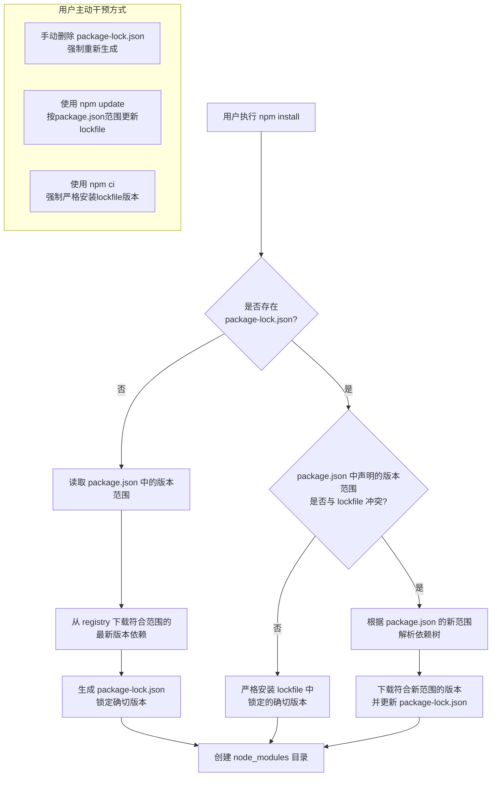
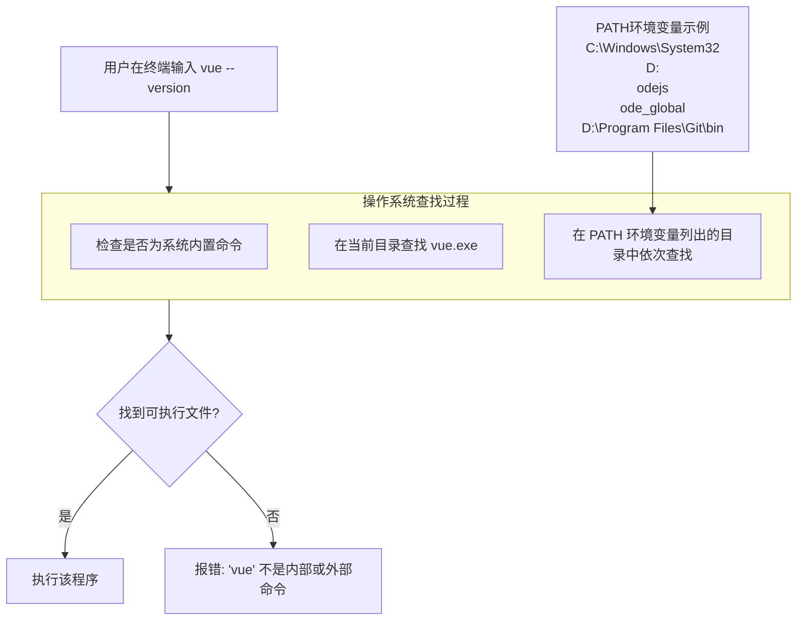

# 🔍 npm 依赖管理与环境变量原理深度解析

## 1. package.json 与 package-lock.json 的优先级与更新机制

这是 npm 依赖管理的核心逻辑，我用一个流程图来展示 npm 如何处理这些文件：



**总结一下关键行为**：
- **有 lockfile 且无冲突**：严格安装 lockfile 版本（保证一致性）
- **有 lockfile 但有冲突**：按 package.json 解析并更新 lockfile（适应变更）
- **无 lockfile**：按 package.json 解析并生成 lockfile（初始化）

**最佳实践建议**：
- 正常情况下使用 `npm install`，让 npm 智能处理
- 在 CI/CD 流水线中使用 `npm ci`，保证绝对一致
- 要更新依赖时使用 `npm update <package-name>`

## 2. 多版本 Node.js 与环境变量配置

### 环境变量配置原理

你观察得很仔细！环境变量确实有两种设置方式：

1.  **直接添加到 PATH**：`PATH=D:\nodejs\node_global;%PATH%`
2.  **先定义变量再引用**：`NODE_GLOBAL=D:\nodejs\node_global` + `PATH=%NODE_GLOBAL%;%PATH%`

**第二种方式更好**，因为：
- 更易于维护（只需修改一个地方）
- 更清晰易懂
- 可以在多个地方引用同一个变量

### 多版本 npm 配置管理

```bash
# 1. 首先设置系统环境变量（只需设置一次）
NODE_GLOBAL = D:\nodejs\node_global
NODE_CACHE = D:\nodejs\node_cache

# 2. 在 PATH 中添加引用
PATH = %NODE_GLOBAL%;%NODE_CACHE%;...其他路径...

# 3. 为每个 Node 版本配置 npm（需要分别设置）
nvm use 18.16.0
npm config set prefix "%NODE_GLOBAL%\node-v18"
npm config set cache "%NODE_CACHE%\node-v18"

nvm use 16.20.0  
npm config set prefix "%NODE_GLOBAL%\node-v16"
npm config set cache "%NODE_CACHE%\node-v16"
```

**为什么不会混乱**？因为每个 Node 版本都有自己的配置存储位置，nvm 通过修改环境变量来切换激活的版本。

## 3. 环境变量的工作原理：为什么 PATH 如此重要

### 操作系统如何查找命令？

当你输入 `vue` 或 `npm` 时，操作系统的查找过程是这样的：



### 实际配置示例（Windows系统）

**系统环境变量设置：**
```
变量名: NODE_GLOBAL
变量值: D:\nodejs\node_global

变量名: NODE_CACHE  
变量值: D:\nodejs\node_cache
```

**PATH 变量设置：**
```
%NODE_GLOBAL%;
C:\Windows\System32;
C:\Windows;
...其他路径...
```

### 为什么这样配置就能工作？

1.  **定义变量**：`NODE_GLOBAL=D:\nodejs\node_global` 创建了一个指针
2.  **引用变量**：`PATH=%NODE_GLOBAL%` 相当于 `PATH=D:\nodejs\node_global`
3.  **系统查找**：当输入 `vue` 时，系统会在 `PATH` 的所有目录中查找 `vue.exe`
4.  **找到执行**：在 `D:\nodejs\node_global` 中找到 `vue.exe` 并执行

## 4. 给你的实际建议和操作步骤

### 清理和重新配置步骤

1.  **首先统一管理方式**：
    ```bash
    # 卸载手动安装的 Node.js
    # 彻底删除旧的环境变量
    # 完全使用 nvm 管理
    ```

2.  **设置系统环境变量**（一次性的）：
    ```
    NODE_GLOBAL = D:\nodejs\node_global
    NODE_CACHE = D:\nodejs\node_cache
    PATH = %NODE_GLOBAL%;%NODE_CACHE%;...原有路径...
    ```

3.  **为每个 Node 版本配置前缀**（每个版本都需要）：
    ```bash
    nvm use 18.16.0
    npm config set prefix "%NODE_GLOBAL%\node-v18"
    npm config set cache "%NODE_CACHE%\node-v18"
    npm config set registry https://registry.npmmirror.com/
    
    nvm use 16.20.0
    npm config set prefix "%NODE_GLOBAL%\node-v16" 
    npm config set cache "%NODE_CACHE%\node-v16"
    npm config set registry https://registry.npmmirror.com/
    ```

4.  **验证配置**：
    ```bash
    # 检查当前配置
    npm config list
    
    # 测试全局安装
    npm install -g @vue/cli
    vue --version  # 应该能正常执行
    ```

## 🎯 总结重点

1.  **lockfile 优先级**：npm 优先使用 lockfile，只在 package.json 版本范围变更时更新它
2.  **环境变量原理**：PATH 告诉系统在哪里查找可执行程序
3.  **变量引用优势**：使用变量引用（如 `%NODE_GLOBAL%`）更易于维护
4.  **多版本管理**：每个 Node 版本需要单独配置，但共享同一套环境变量体系

