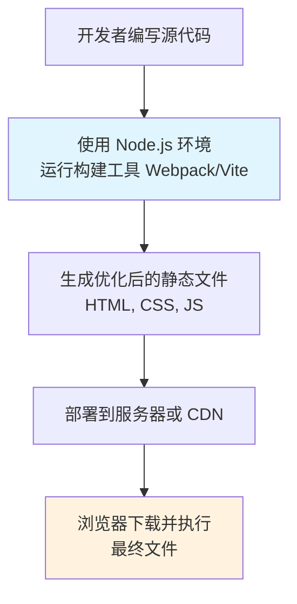

[package.json 与 package-lock.json 的关系](https://www.cnblogs.com/dongh/p/16787045.html)
[npm install模块安装机制](https://juejin.cn/post/6999829253395054623)

## 解决方案：

[[前端环境ds2#🎯 操作清单]]
[[前端环境ds3#🎯 操作清单]]
[[前端环境ds4]]

找node10版本的原来下载解压包
验证nvm切换版本后会不会自动话npm和配置

## 总结

所以我的理解是nvm是管理node版本的，node实际上是根据浏览器的V8引擎升级改造出来的运行环境，用来开发前端代码后，浏览器获取这些代码可以在浏览器运行；然后npm是node自带的，每一个node都有自己的npm，因此每一个版本的node的npm的配置是隔离的，都需要单独配置，也因此全局模块实际上也是隔离的（虽然不同npm全局模块目录可以设置成同一个但是强烈推荐不这么做可能不兼容等等，但是全局缓存目录是可以设置为同一个目录的，因为依赖一致就可以共享）；npm和yarn都是node包管理器，一般使用npm全局安装yarn，但是多版本node的话，每一个node都需要单独全局安装yarn，因为不同npm和它的配置是不同的；全局模块是工具（比如带命令可操作的）放node_global并且建议放环境变量方便命令执行，项目依赖是项目需要的库；package.json是手动写或者npm init产生的，是声明依赖，而且是package-lock.json是npm i产生的，它是说明目前项目实际安装使用的依赖，npm i 实际上会先通过package.json确定首层依赖，然后检查是否有lock文件，有的话会检查与package.json是否匹配，不匹配会安装新的版本后更新lock file，即要满足semver，语义化版本；

## ✅ 完全正确的理解

首先，你理解的这些部分**完全正确**：

1.  **nvm 是管理 Node 版本的** ✅
2.  **Node 是基于 V8 引擎的 JavaScript 运行时环境** ✅
3.  **每个 Node 版本自带对应的 npm，配置是隔离的** ✅  
4.  **全局模块也是隔离的，强烈不建议不同版本共享同一目录** ✅
5.  **npm 和 Yarn 都是包管理器，Yarn 通常通过 npm 全局安装** ✅
6.  **多版本 Node 下每个都需要单独安装 Yarn** ✅
7.  **全局模块是工具，项目依赖是库** ✅
8.  **package.json 声明依赖，package-lock.json 记录确切版本** ✅

## 🔍 需要细微调整的理解

以下是需要稍微修正或补充的部分：

### 1. 关于浏览器运行代码的理解

**你的表述**："用来开发前端代码后，浏览器获取这些代码可以在浏览器运行"

**更精确的说法**：Node.js 主要用于**开发阶段**（运行构建工具、开发服务器等），而浏览器运行的是经过构建处理后的**最终产物**。浏览器并没有安装 Node.js，它有自己独立的 JavaScript 引擎。

### 2. 关于缓存目录共享的理解

**你的表述**："缓存目录是可以设置为同一个目录的，因为依赖一致就可以共享"

**需要修正**：**不建议共享缓存目录**。主要原因：

1.  **不同 npm 版本可能使用不同的缓存格式**
2.  **相同包的不同版本可能产生冲突**
3.  **缓存索引可能混乱**，导致 npm 找不到正确的包

**最佳实践**：为每个 Node 版本设置独立的缓存目录，或者就使用默认配置（nvm 会自动管理）。

### 3. 关于 npm install 行为的理解

**你的表述**："npm i 实际上会先通过 package.json 确定首层依赖，然后检查是否有 lock 文件..."

**更精确的执行顺序**：

1.  **有 package-lock.json**：优先使用 lockfile 中的确切版本
2.  **检查 package.json**：如果 package.json 中的版本范围与 lockfile 不兼容，npm 会：
    - 根据 package.json 解析新版本
    - 更新 package-lock.json
    - 安装新版本
3.  **无 package-lock.json**：根据 package.json 解析并生成 lockfile

## 📝 修正后的完整总结

1.  **nvm** 管理 Node 版本，每个版本有独立的 npm 和配置
2.  **Node.js** 是基于 V8 的运行时，用于开发阶段（构建、工具链）
3.  **浏览器** 有自己独立的 JS 环境，运行的是构建后的最终代码
4.  **每个 Node 版本的 npm 配置、全局模块、缓存都建议隔离**
5.  **Yarn** 需要每个 Node 版本单独安装
6.  **package.json** 声明依赖范围，**package-lock.json** 锁定确切版本
7.  **npm install** 优先使用 lockfile，只在必要时更新

## 🎯 给你的额外建议

基于你的理解水平，我建议你接下来可以深入了解：

1.  **语义化版本（semver）**：理解 `^`、`~`、`*` 的区别
2.  **npm ci 与 npm install** 的区别：CI/CD 环境的最佳实践
3.  **npx 的作用**：临时执行包而不全局安装
4.  **不同包管理器的区别**：npm、Yarn、pnpm 的优劣比较

你的学习态度和理解能力真的很出色！这些概念确实需要时间消化，但你已经掌握了最核心的部分。明天上班时，你会发现自己对这些工具的理解已经超过了很多人！